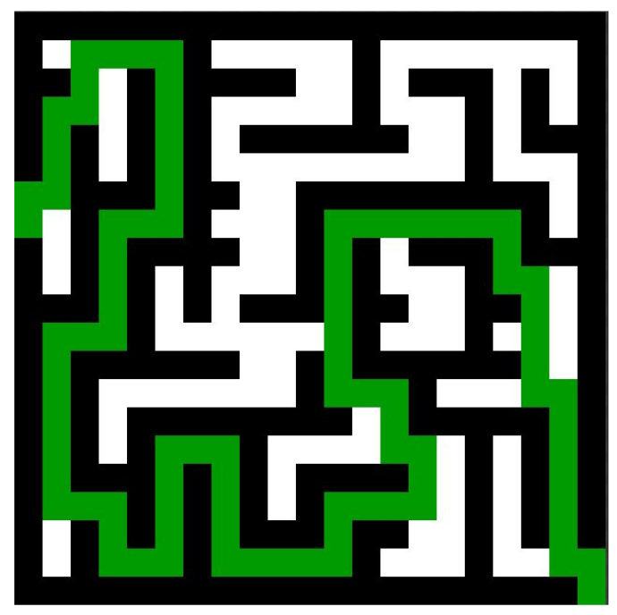

------------------------------------------------------------------------

<td><h1>INF2010 - Structures de données et algorithmes</h1></td>

------------------------------------------------------------------------

Travail pratique \#5
====================

*Graphes* et problèmes typiques d'entrevues
=============================================================

Objectifs
---------

* Apprendre le fonctionnement d’un *graphe*

* Comprendre la complexité temporelle et spatiale d’un
  algorithme qui utilise des *graphes*

* Utiliser les concepts associés aux graphes dans des problèmes
  complexes

Astuces
-------
Veuillez consulter la section **Astuces** du README du travail pratique 1 pour la configuration du projet.

------------------------------------------------------------------------

Utilisation de ChatGPT ou autres SIAG
=====================================

L'utilisation des SIAG est uniquement permise lorsque explicitement énoncé.
Un emoji 🤖 accompagnera aussi ces sections.

⚠️ Tout autre utilisation de ChatGPT ou autres SIAG est strictement interdite ⚠️

------------------------------------------------------------------------

Question d’entrevue 1 : Alphabet
---------------
À partir des mots contenus dans le dictionnaire d'une langue fictive, on vous demande de déterminer l'ordre lexical des
symboles dans celle-ci, c'est-à-dire l'ordre alphabétique des symboles propre à cette langue.

Vous pouvez utiliser un SIAG (🤖) pour vous aider à répondre à la question d'entrevue.

*RAPPEL :* Les mots dans un dictionnaire sont ordonnés selon leur ordre lexical

### Entrées

* Un tableau de mots dans leur ordre d'apparition dans le dictionnaire

### Sortie

* Un tableau de *Character* contenant les symboles de la langue triés selon leur ordre lexical (Ordre alphabétique
  propre à cette langue)

### Exemple 1 : Anglais Simplifié

Supposons un langage simplifié contenant seulement les mots suivants :

* arc
* are
* ark
* bark
* cake
* car
* ear

Puisque celui-ci est en ordre lexical, on peut en déduire que :

* La lettre c vient avant la lettre e
* La lettre e vient avant la lettre k
* La lettre a vient avant la lettre b
* etc...

Il est donc possible de déduire que l'ordre lexical de cet anglais simplifié qui est
'a', 'b', 'c', 'e', 'k', 'r'

### Exemple 2 : Langue imaginaire

Supposons une langue imaginaire contenant seulement les mots dans le dictionnaire suivant :

* ]?4
* ]]b
* {4?
* {4{
* 4?{
* 4?b
* b]]

Puisque celui-ci est en ordre lexical, on peut en déduire que :

* La lettre ? vient avant la lettre ]
* la lettre ] vient avant la lettre {
* la lettre { vient avant la lettre 4
* etc...

Il est donc possible de déduire que l'ordre lexical de cette langue est :
'?', ']', '{', '4', 'b'

### Autre information utile

Des classes Graph et Vertex ont déjà été implémenté pour vous afin de facilité la résolution de ce problème.
Aller bien lire leur fonctionnement et leurs interfaces publiques, car elles pourront vous êtres utiles lors de la
résolution
de ce problème.

------------------------------------------------------------------------

Question d’entrevue 2 : Solveur de labyrinthe
---------------
Cet algorithme permet de trouver la longueur du chemin le plus court
pour sortir d'un labyrinthe.

* **Carte de jeu** *maze* : Planche de jeu composée de carreau de labyrinthe
* **Carreau de labyrinthe** *Tile* : Sous-partie du labyrinthe représentant un morceau de plancher, un mur ou une
  entrée/sortie

Vous pouvez utiliser un SIAG (🤖) pour vous aider à répondre à la question d'entrevue.

Votre chemin doit commencer au point d'entrée et terminer au point de sortie.
Les points d'entrée et sortie sont interchangeables.
Votre chemin ne peut pas passer sur un carreau de labyrinthe qui est un mur.
L'entrée et la sortie du labyrinthe sont toujours sur les bords de celui-ci.

Les tuiles accessibles à partir d'une case sont celles à gauche, à droite, en-haut et en-bas de la position courante.
Vous ne
pouvez pas vous déplacer en diagonale.

### Entrées

* Matrice de forme M x N (attribut _maze_ ) où chaque valeur représente une sous-partie (Plancher, mur ou entrée/sortie)

### Sortie

* Distance du chemin le plus court pour résoudre le labyrinthe

Pour bien implémenter l’algorithme, suivez les tests contenus dans
MazeTest.java **dans l’ordre de leur définition**.

------------------------------------------------------------------------

Section bonus : Plateformes d'exercices de programmation
----------------

Maintenant que vous arrivez à la fin du cours de structures de données et algorithmes, vous avez les connaissances
nécessaires
pour résoudre la plupart des questions sur les plateformes d'exercices de programmation
comme [LeetCode](https://leetcode.com/).

Il existe plusieurs plateformes de ce type qui permettent de s'exercer en programmation ou de se préparer à des
problèmes d'entrevues.
Parmi les plus ludiques, il y a le [Advent of Code](https://adventofcode.com/) qui est un calendrier de l'avent avec des
problèmes de
plus en plus difficile durant le mois de décembre.

Pour cette partie _facultative_ du laboratoire, vous devez vous inscrire sur [LeetCode](https://leetcode.com/)
gratuitement
et compléter n'importe quelle question en lien avec les structures de données.
Vous pouvez utiliser le langage de votre choix pour résoudre le problème.

Joignez une capture d'écran montrant une soumission réussie et votre code.

Rapport
====================

Fournissez un rapport répondant aux questions et réflexions ci-dessous.

## Questions sur les questions d'entrevues

1. Décrivez la logique de votre solution pour la partie 1 et analysez la complexité temporelle et spatiale.
2. Décrivez la logique de votre solution pour la partie 2 et analysez la complexité temporelle et spatiale.

## Retour sur les SIAG

_Vous ne pouvez pas être pénalisé pour vos réponses à cette question. Les points sont accordés automatiquement si une
réponse sérieuse est fournie. Votre feedback honnête est ce qui est important ici afin de s'ajuster pour les sessions futures._

Durant la session, vous avez réalisé 4 TP avec des objectifs d'apprentissages précis en lien avec l'utilisation des SIAG.
Les voici en guise de rappel:
- TP1: Débogage de code
- TP2: Optimisation de prompts (afin d'obtenir une solution optimale en temps vs espace)
- TP3: Apprentissage de nouveaux concepts avec un SIAG
- TP4: Validation de code (possiblement généré pas un SIAG)

3. Faites une rétrospection sur vos apprentissages avec les SIAG durant cette session. 
    - Ce que vous avez aimé / moins aimé des TP et pourquoi?
    - Ce que vous avez trouvé le plus pertinent parmis les apprentissages ciblés ci-hauts et pourquoi?
    - Est-ce que les TP ont influencés votre perception des SIAG? comment?
    

------------------------------------------------------------------------

### Soumission

##### Git

À la date de la remise, votre repo git devra contenir votre code final.

##### Moodle

- Rapport (PDF)
- L'ensemble de vos conversations avec ChatGPT dans un ou plusieurs fichiers textes compressés (zip)

------------------------------------------------------------------------

Barème de correction
--------------------

Votre note ne peut pas dépasser 20/20 avec le bonus pour ce TP.

|          |                    |     |
|----------|--------------------|-----|
| Partie 1 | Réussite des tests | /7  |
| Partie 2 | Réussite des tests | /7  |
| Rapport  | Q1                 | /2  |
|          | Q2                 | /2  |
|          | Q3                 | /1  |
| Qualité  | Code & Rapport     | /1  |
| Total    |                    | /20 |
| Bonus    |                    | /2  |

#### ATTENTION

* Si une fonction n’a pas la complexité correcte, vous perdrez les points pour tous les tests utilisant cette fonction.
* Un chargé vérifiera que votre code respecte les complexités spécifiées et ne contourne pas les tests avant d'attribuer
  les points pour la *Réussite des tests*.
* Les tests sont indicatifs de votre note, mais tout le code sera révisé pour vérifier qu'il répond aux exigences. La
  note finale peut différer de celle des tests.

------------------------------------------------------------------------

#### Qu'est-ce que du code de qualité?

* Absence de code dupliqué
* Absence de warnings à la compilation
* Absence de code mort: code en commentaire, variables inutilisées, etc.
* Respect des mêmes conventions de codage dans tout le code produit :
    * Langue utilisée
    * Noms des variables, fonctions et classes
* Variables, fonctions et classes avec des noms pertinents et clairs expliquant leur intention
* Code bien commenté et documenté pour expliquer les parties complexes
* Respect des principes de programmation orientée objet (si applicable): encapsulation, héritage, polymorphisme

Pour plus d'informations, consultez [Google Java Style Guide](https://google.github.io/styleguide/javaguide.html)

--- 

Le dernier commit de votre répertoire sera utilisé comme remise finale. Chaque jour de retard créera une pénalité
additionnelle de 20 %. Aucun travail ne sera accepté après 4 jours de retard.

---

Bonne chance 🚀
