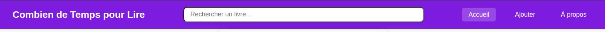
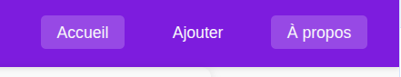
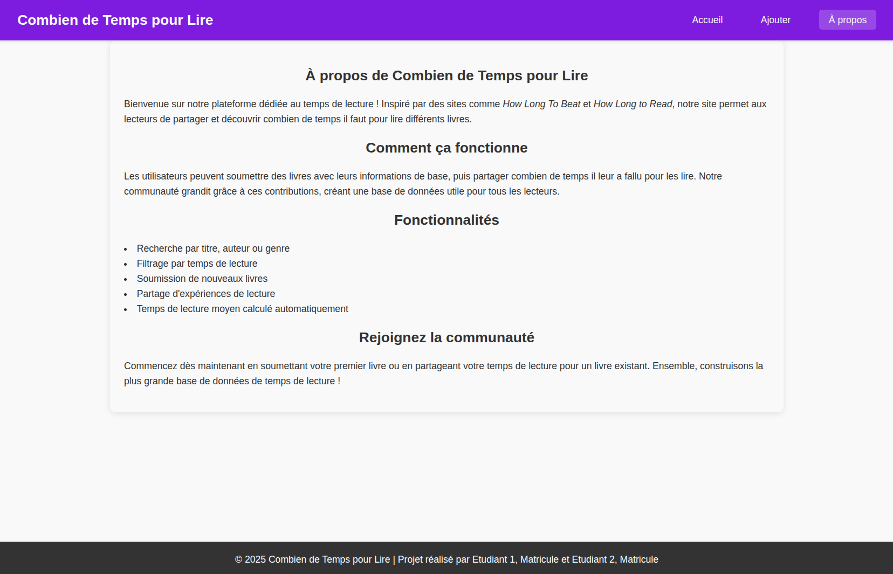
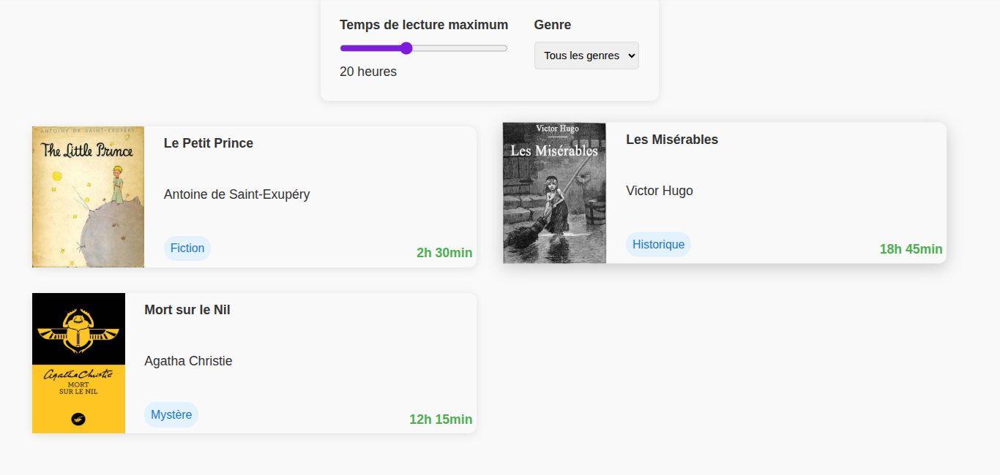
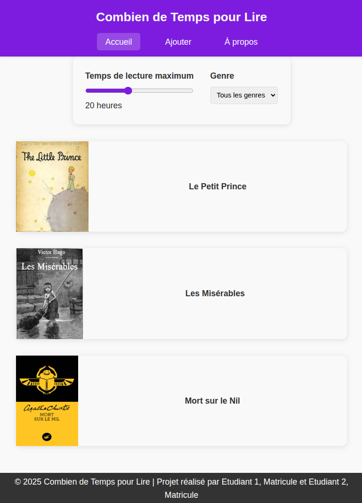
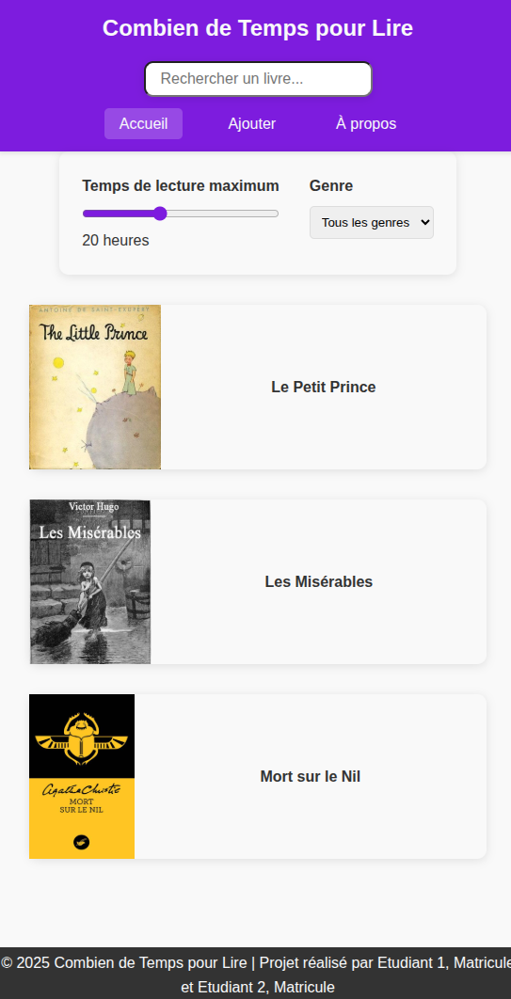
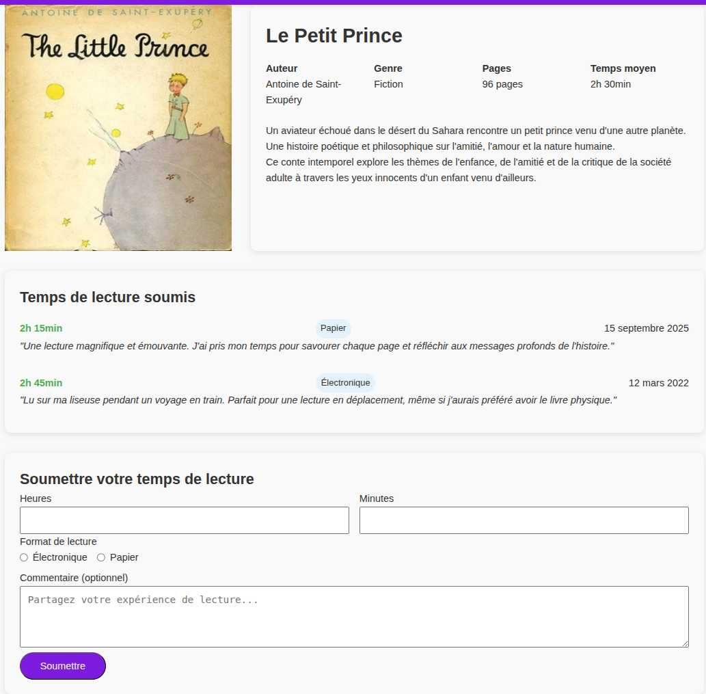
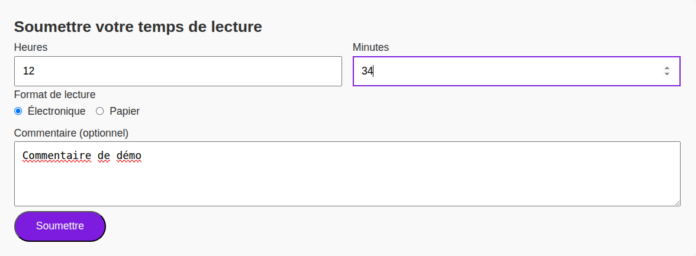
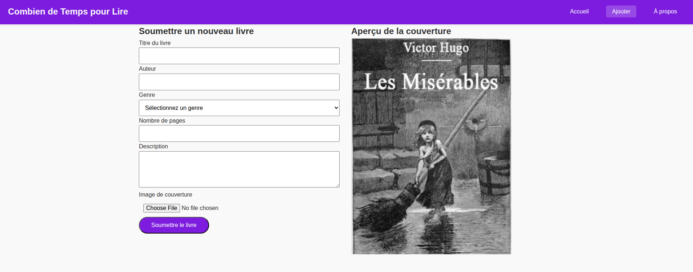

[](https://classroom.github.com/a/H_grP0bF)
# TP1

Le but de ce travail pratique est de vous familiariser avec les langages **HTML** et **CSS**. Vous pourrez aussi vous familiariser avec l’exécution de tests automatisés avec la librairie **Cypress**.

## Mise en situation

Le site web que vous allez créer est un site qui permet aux usagers de consulter le temps moyen nécessaire pour lire un livre, de rajouter son propre temps de lecture ainsi que de rajouter un nouveau livre à la banque de données. Ce site s'inspire de sites existants tels que [How Long to Read](https://howlongtoread.com/) et [How Long To Beat](https://howlongtobeat.com/) (pour les jeux vidéo).

**Note** : ce travail se concentre sur la structure HTML et le style CSS des pages. Vous n'aurez pas à implémenter de logique JavaScript pour ce travail.

## Installation des librairies nécessaires

Vous aurez besoin de l'environnement d'exécution `NodeJS` et son gestionnaire de paquet `npm`. Vous pouvez les installer sur votre machine à partir du [lien suivant](https://nodejs.org/en/download/). On vous recommande d'installer la version *LTS*.

Pour installer les dépendances nécessaires, lancez la commande `npm ci` dans la racine du projet. Ceci installera toutes les librairies définies (`http-server` et `cypress` ) dans le fichier `package.json` avec les versions exactes définies dans `package-lock.json`.

## Exécution des tests

Consultez le fichier [TESTS.MD](./TESTS.MD) pour une description détaillée de l'outil Cypress et le fonctionnement des tests.

**Note** : commencez par les tests de `intro.cy.js` qui ne valident que le HTML/CSS de l'élément `<footer>`. Initialement, les tests pour le bas de page vont échouer puisque leur code n'est pas complet. On vous recommande **fortement** de commencer par compléter cette partie du TP en premier en utilisant les tests comme guide. Lisez bien le code dans [`shared.js`](./cypress/e2e/shared.js) pour mieux comprendre le résultat attendu.

## Déploiement local

Vous pouvez faire un déploiement local de votre site avec l'outil `http-server`. Si vous lancez la commande `npm start`, un serveur HTTP statique sera déployé sur votre machine et votre site sera accessible sur l'adresse `localhost:3000` ou `<votre-adresse-IP>:3000`. La sortie dans le terminal vous donnera l'adresse exacte d'accès.

## Description du travail

### Règles CSS

Votre travail utilisera un mélange de règles CSS partagés par plusieurs pages et des règles spécifiques à chaque page. Vous devez compléter les fichiers CSS fournis pour respecter le visuel des pages.

Quelques règles et sélecteurs vous sont fournis pour vous aider à débuter le travail. Un ensemble de variables CSS est également fourni dans le fichier [shared.css](./src/css/shared.css) pour vous aider à respecter les couleurs du site. Vous pouvez modifier ces variables si vous le souhaitez, mais vous devez utiliser les variables et non des valeurs hexadécimales dans vos règles CSS.

Le reste du code CSS à compléter par vous se trouve dans les fichiers `css` fournis. Le fichier [shared.css](./src/css/shared.css) devra contenir les règles communes à toutes les pages, notamment l'entête et le bas des pages ainsi que la mise en page des formulaires des pages `book.html` et `add.html`. Les autres fichiers CSS contiendront les règles spécifiques à chaque page.

### Entête

L'entête contient 3 sections distinctes alignées à gauche, au centre et à droite respectivement. Toutes les pages partagent le même entête sauf pour la page principale qui contient une barre de recherche au centre.

<div style="display:flex; justify-content:center; width:100%; margin:20px">
    
</div>

#### Première section

Contient le nom du site d'une largeur fixe de votre choix qui redirige vers la page principale.

#### Deuxième section

Contient une barre de recherche composée d'un champ de saisie avec une valeur temporaire. Il n'y a pas de bouton de recherche et la barre a une longueur maximale de 600px.

Cette section est vide sur toutes les pages sauf pour la page principale.

Référez-vous aux tests dans le fichier [index.cy.js](./cypress/e2e/index.cy.js) pour vous aider avec la structure de la barre de recherche.

#### Troisième section

Contient des liens vers les pages `index.html`, `add.html` et `about.html` espacés uniformément. En fonction de la page en cours (page active), l'élément correspondant doit être mis en évidence à l'aide de la classe `active` définie dans le fichier [shared.css](./src/css/shared.css).

Lorsqu'un utilisateur passe sa souris par-dessus l'un des éléments de la barre de navigation, l'élément devrait être souligné avec le même visuel que la page active. Voici un exemple avec la page `À propos` active et `Accueil` survolée :

<div style="display:flex; justify-content:center; width:100%; margin:20px">
    
</div>

### Bas de page

Cette section doit toujours être placée en bas de la page, occuper la totalité de sa largeur et être de la couleur de fond _primaire_ du site. Le bas de page est le même pour toutes les pages du site.

La section contient le nom et matricule de chaque membre de l'équipe alignés au centre avec un identifiant unique. Référez-vous aux tests dans le fichier [shared.cy.js](./cypress/e2e/shared.js) pour les identifiants à utiliser.

## Page À propos (about.html)

La page `about.html` devrait être similaire à celle-ci. Le code HTML et CSS du contenu principal vous est majoritairement fourni pour vous aider à débuter votre TP. Vous pouvez utiliser cette page pour vérifier le thème visuel de votre site. La couleur de fond du contenu principal doit être différente de la couleur de fond de l'entête et le bas de page.

<div style="display:flex; justify-content:center; width:100%; margin:20px">
    
</div>

## Page Principale (index.html)

Consultez le fichier [data.json](./src/data.json) pour les informations détaillées des livres. Vous pouvez utiliser le même ordre que dans la capture d'écran plus bas.

Le contenu principal de la page est centré dans un conteneur d'une largeur maximale de `1200px` comme toutes les autres pages. Le conteneur est divisé en 2 sections : les filtres et la liste des livres.

Les filtres sont composés d'un champ de saisie de type glisseur pour la durée maximale de lecture et d'une liste déroulante pour le genre de livre. Pour la durée maximale contrôlée par le glisseur, vous devez utiliser des identifiants spécifiques : `max-time` et `time-display`. Ces ids sont utilisés par le code JS à la fin de la page HTML pour mettre à jour l'affichage des heures sous le glisseur en fonction de sa valeur. Pour la liste de genres, les choix sont les suivants : `Tous les genres`, `Fiction`, `Science-fiction`,`Fantasy` et `Historique`.

La liste des livres est composée de vignettes de livres. Chaque vignette contient une image du livre (taille fixe de `150px`*`175px`), le titre, l'auteur, le genre et le temps moyen de lecture. Le titre du livre est affiché en gras et est un lien qui redirige vers la page `book.html` avec l'identifiant du livre dans l'URL. Ex : `book.html?id=1`. Le temps moyen de lecture est affichée toujours dans le coin inférieur droit avec une couleur différente et le format `HH:MM`. Le genre est affiché dans une ellipse de couleur bleue avec le texte bleu foncé.

Les vignettes sont organisées dans une grille de taille flexible. L'espace entre les vignettes est laissé à votre choix. Chaque colonne de la grille doit avoir une largeur minimale de `400px` et une taille maximale de `1fr`. Ceci veut dire qu'avec une taille maximale de `1200px`, il y aura 2 colonnes et en bas de `800px` + l'espacement, il y aura 1 seule colonne.

Lorsqu'on survole une des vignettes avec la souris, il doit y avoir un double effet de mise en évidence : la vignette doit être légèrement déplacée vers le haut et un effet d'ombre (attribut CSS `box-shadow`) doit être appliqué. Ces transitions ne doivent pas être instantanées, mais doivent être animées avec une durée de transition de votre choix (en bas de 1s).

Voici un exemple de la page principale avec un survol de la souris sur le deuxième livre :

<div style="display:flex; justify-content:center; width:100%; margin:20px">
    
</div>

## Effets de réduction de la largeur de l'écran

Lorsqu'un utilisateur réduit la largeur de l'écran sous une certaine taille, le visuel de la page principale doit changer. Voici les 2 seuils à considérer :

1. Sous **800px** :  l'entête est centrée et les éléments de navigation sont sous le titre. Les vignettes sont placées en une seule ligne verticale et centrées horizontalement. Seulement le nom du livre est visible, mais fonctionne toujours comme un lien.

2. Entre **600px** et **800px** : la barre de recherche n'est pas affichée.

Le comportement des vignettes devrait être le même, peu importe la largeur.

Voici un exemple de la page principale à une largeur de **700px** :

<div style="display:flex; justify-content:center; width:100%; margin:20px">
    
</div>

Voici le visuel de la page à une largeur de **550px** :

<div style="display:flex; justify-content:center; width:100%; margin:20px">
    
</div>

## Page Détails (book.html)

Cette page est accessible à travers un clic sur une des vignettes de la page principale. Le contenu de la page est toujours le même et basé sur le premier élément du fichier `data.json`, peu importe la vignette cliquée.

Le visuel de la page `book.html` devrait être similaire à celui-ci : 
<div style="display:flex; justify-content:center; width:100%; margin:20px">
    
</div>

Le contenu principal de la page est centré et divisé en 3 sections : l'information du livre, les temps de lecture soumis et un formulaire de soumission.

Le conteneur de l'image est d'une hauteur fixe de **400px** et une largeur de 100%. Les informations du livre sont affichées à droite de l'image. Le titre du livre est affiché en gras, les autres informations doivent être placés dans un conteneur et suivre le format uniforme suivant :
```html
<div class="book-info-item">
    <span class="book-info-label">Type Info</span>
    <span class="book-info-value">Valeur</span>
</div>
```

Vous devez utiliser ces classes pour avoir des éléments HTML uniformes. Vous devez utiliser une grille CSS (_grid_) ou des boîtes flexibles (_flexbox_) pour la mise en page des éléments internes de cette section, mais le choix exact est laissé à votre discrétion.

Référez-vous aux tests dans le fichier [book.cy.js](./cypress/e2e/book.cy.js) pour les identifiants et classes à utiliser pour les différents éléments HTML.

La liste des temps de lecture soumis est affichée dans une liste verticale. Chaque élément de la liste contient le temps, le format (Papier ou Électronique), la date et le commentaire (en _italique_). Les 3 premières informations sont espacées uniformément entres-elles à l'horizontale.

### Formulaire de soumission

Le formulaire contient trois champs obligatoires : le temps en heures et minutes ainsi que le format de lecture. Le temps maximal de lecture est de **100 heures** et les minutes ne peuvent pas dépasser **59**. Contrairement à la barre de recherche, la méthode de soumission du formulaire est de type `POST`.

Le champ de commentaire est optionnel et est une boîte de texte riche `<textarea>` avec un texte temporaire (_placeholder_). Elle doit être redimensionnable seulement verticalement et sa taille verticale ne peut pas aller en bas de **100px**. Sa taille horizontale est fixe et prend toute la largeur disponible.

#### Mise en page uniforme

Le formulaire de cette page ainsi que la page `add.html` doivent avoir une mise en page uniforme. Vous devez donc englober les différents éléments du formulaire dans un conteneur avec la classe `form-group`. Quelques règles CSS vous sont fournies dans [shared.css](./src/css/shared.css) pour vous aider à débuter. Attention à la duplication de code CSS pour les deux pages.

Lorsqu'un champ de saisie est sélectionné, il doit avoir un effet de contour avec la couleur _d'accent_ du site web. Cette couleur est partagée avec le bouton de soumission également. Voici un exemple du formulaire en état de remplissage :

<div style="display:flex; justify-content:center; width:100%; margin:20px">
    
</div>

## Page d'Ajout (add.html)

Cette page contient un formulaire pour l'ajout d'un nouveau livre. Le visuel est le suivant :

<div style="display:flex; justify-content:center; width:100%; margin:20px">
    
</div>

Le formulaire est composé de deux sections affiché sur 2 colonnes. Chaque information doit être accompagnée d'une étiquette appropriée. Les différents éléments sont alignés à gauche.

La première section contient les informations générales de l'ajout : titre, auteur, genre (mêmes choix que pour la page principale sauf le 1er qui doit être `Sélectionnez un genre`), nombre de pages, description et image de couverture. Tous les champs doivent être remplis pour bien soumettre le formulaire.

Un livre doit avoir au moins 1 page et l'auteur doit avoir au moins 3 caractères dans son nom. La description est une boîte de texte riche `<textarea>` avec un texte temporaire (_placeholder_) et a les mêmes contraintes de redimensionnement que pour la page `book.html`. Lorsque le bouton de sélection de fichier est cliqué, un explorateur de fichiers s'ouvre pour permettre à l'utilisateur de sélectionner une image et pas n'importe quel fichier. **Note** : ce formulaire contient un fichier. L'attribut `enctype` doit donc avoir une valeur spécifique différente de la valeur par défaut.

Le visuel des éléments du formulaire est partagé avec la page `book.html`. Vous devez donc utiliser les mêmes classes CSS pour les éléments du formulaire (`form-group`). Attention à la duplication de code CSS pour les deux pages.
**Note** : un `<input type="file">` est limité au niveau des changements CSS.

La deuxième section contient l'aperçu de la couverture. L'image est statique et vous est déjà fournie. Vous devez ajouter le HTML et CSS nécessaire pour afficher l'information en deux colonnes comme dans la capture d'écran. 

Référez-vous aux tests dans le fichier [add.cy.js](./cypress/e2e/add.cy.js) pour les identifiants et classes à utiliser pour les différents éléments HTML.

## Fonctionnalité bonus

Dans la version de base, l'image de couverture de la page `add.html` est statique et ne change pas lorsqu'un fichier est sélectionné. Pour la fonctionnalité bonus, vous devez ajouter du code JS pour que l'image de couverture change lorsque l'utilisateur sélectionne un fichier valide : la mise à jour doit avoir lieu au choix du fichier et non seulement à la soumission du formulaire. Au chargement de la page, l'image fournie peut être affichée par défaut.

**Note** : ceci peut demander des notions pas nécessairement vues en classes. Utilisez les ressources en ligne pour vous aider.

# Correction et remise

La grille de correction détaillée est disponible dans [CORRECTION.MD](./CORRECTION.MD). L'ensemble des tests fournis doit réussir lors de votre remise.

Le travail doit être remis au plus tard le vendredi 19 septembre à 23:59 sur l'entrepôt Git de votre équipe. Le nom de votre entrepôt Git doit avoir le nom suivant : `tp1-matricule1-matricule2` avec les matricules des 2 membres de l’équipe.

**Aucun retard ne sera accepté** pour la remise. En cas de retard, la note sera de 0.