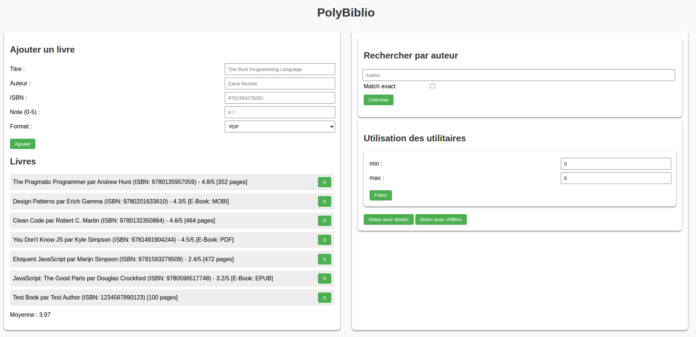
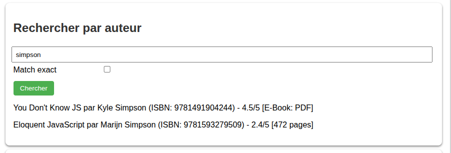
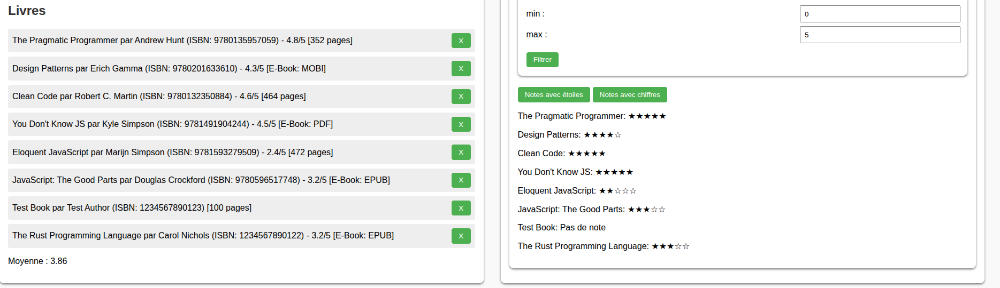

[](https://classroom.github.com/a/YjVwa19b)
# TP2 PolyBiblio

Le but de ce travail est de vous introduire au langage de programmation JavaScript (variables, fonctions, objets, traitement des tableaux, prototypes, modules ESM, etc.), la configuration d'un outil de développement ainsi qu'introduire des notions de vérification automatisée à travers des tests unitaires. Vous allez vous familiariser avec la syntaxe moderne (ES2015+) de JavaScript et l'intégration du code JS à une page web. Finalement, vous utiliserez un outil d'analyse statique pour le respect de conventions de programmation (_linter_) : ESLint. Cet outil définit un ensemble de règles à suivre pour un code uniforme et standard.

## Installation des librairies nécessaires

Pour installer les dépendances nécessaires, lancez la commande `npm ci` dans la racine du projet. Ceci installera toutes les librairies définies dans le fichier `package.json` avec les versions exactes définies dans `package-lock.json`.

## Exécution des tests

Consultez le fichier [TESTS.MD](./TESTS.MD) pour plus d'informations sur les tests fournis.

## Analyse statique du code

Vous utiliserez l'outil d'analyse statique (_linter_) `ESLint`. Cet outil permet de vérifier que votre code respecte un certain nombre de règles définies dans le fichier de [configuration](./eslint.config.mjs). Par exemple : vous ne pouvez pas utiliser le mot clé `var`, vous devez utiliser `===` et non `==`, etc. Vous pouvez lancer cet outil à l'aide de la commande `npm run lint` dans votre terminal.

## Déploiement local

Vous pouvez faire un déploiement local de votre site avec l'outil `http-server`. Si vous lancez la commande `npm start` dans le répertoire `site`, un serveur HTTP statique sera déployé sur votre machine et votre site sera accessible sur l'adresse `localhost:3000` ou `<votre-adresse-IP>:3000`. La sortie dans le terminal vous donnera l'adresse exacte d'accès.

# Description du travail à compléter

Le but de ce travail pratique est la mise en place d'un système de gestion d'une bibliothèque de livres. Ce système permet d'afficher une listes de livres, d'ajouter un livre ou d'en supprimer. Le système permet de faire des recherches dans la listes des livres, filter par la note ainsi qu'appliquer le patron de conception [Stratégie](https://refactoring.guru/design-patterns/strategy) pour le formatage de l'affichage.

La première partie du travail est l'implémentation du système de gestion de bibliothèque. Ce travail pratique se concentre sur le langage JavaScript. La grande majorité des intéractions avec le DOM vous sont fournies dans le fichier [index.js](./src/assets/index.js). Vous aurez à intégrer votre code dans ce fichier pour compléter les fonctionnalités demandées. Vous n'aurez pas à modifier le HTML ou le CSS de la page, mais vous pouvez ajouter des classes CSS si vous le souhaitez.

La deuxième partie de ce travail pratique va vous guider dans la configuration d'un outil de *Build* pour votre projet. Vous allez utiliser [Vite](https://vite.dev/), un outil de construction moderne qui facilite le développement d'applications web. Vous pouvez faire cette partie du travail au début ou à la fin de votre travail, selon vos préférences.

## Partie 1 : langage JavaScript

Pour cette partie, vous devez compléter les fichiers JavaScript suivants : [books.js](./src/assets/books.js), [utils.js](./src/assets/utils.js) et [library.js](./src/assets/library.js).

**Attention** : afin de maîtriser la manipulation des tableaux de JS, vous ne pouvez pas utiliser les boucles `for` ou `while` classiques. Vous devez utiliser les méthodes de manipulation des tableaux telles que `map`, `filter`, `reduce`, etc. pour parcourir et manipuler les tableaux. Votre implémentation doit avoir **au moins 1 utilisation des méthodes suivantes** : `map`, `filter`, `reduce` et `find` Vous pouvez les utiliser plusieurs fois si vous le souhaitez, mais au moins une fois chacune.

### Structure des données et prototypes

Un livre est un objet JS avec des attributs et une seule méthode. Voici un exemple  :
```js
{
    title: "Design Patterns",
    author: "Erich Gamma",
    isbn: "9780201633610",
    rating: "4.3",
},
```
La fonction `getInfo` retourne l'information du livre dans un format quelconque. La note (`rating`) est un attribut optionnel qui peut être `null` et ne sera pas contenu dans l'information retournée.

Chaque livre possède un ISBN unique (code à 13 chiffres) qui permet de l'identifier.
**Note** : à des fins de simplification, vous n'avez pas à vérifier la validité de l'ISBN. Le système peut accepter des ISBNs qui n'ont pas 13 chiffres, mais vous devez vous assurer que l'ISBN est unique pour chaque livre ajouté.

Vous trouverez quelques entrées de départ dans le fichier [data.js](./src/assets/data.js) pour vous aider à débuter votre travail.

Le système à mettre en place gère 2 types de livres avec des attributs supplémentaires : 
- Livres physiques (`PrintedBook`) ayant un nombre de pages.
- Livres numériques (`Ebook`) ayant un format. Seulement les livres numériques peuvent être ajoutés à travers la page web.
 
Initialement, ces objets sont implémentés avec des fonctions constructeurs et utilisent la notions de prototypes pour établir des liens entre eux. Vous devez transformer ces fonctions constructeurs en classes ES2015. Notez que la fonction `getInfo` est modifiée dans les objets `PrintedBook` et `Ebook` pour retourner des informations supplémentaires sur le livre.

Si le transfert a été bien fait, vous pouvez exécuter les tests fournis dans [books.test.js](./tests/books.test.js) et ils devraient réussir. La commande `npm run test:books` permet d'exécuter seulement ces tests.

### Fonctions de JavaScript et patron de conception Stratégie

Cette partie du travail permet de vous familiariser avec les fonctions de JS et le fait qu'une fonction peut être passée en paramètre d'une autre fonction ou peut être retournée par une fonction. De plus, le patron de conception Stratégie est utilisé pour appliquer différentes stratégies de formatage d'affichage des livres en passant la _stratégie_ de formatage en paramètre d'une fonction.

La fonction `createRatingFilter(rating = {min,max})` retourne une fonction qui permet de filtrer les livres par note. La fonction retournée prend en paramètre un livre et retourne `true` si la note du livre est dans l'intervalle défini par les valeurs minimales et maximales (bornes incluses), ou `false` sinon. Si le livre n'as pas de note, la fonction retourne `false`.

La fonction `starFormatStrategy` prend un livre et retourne une chaîne de caractères formatée avec des étoiles pleines ou non. Si le livre n'a pas de note, la fonction retourne `Pas de note`. La note est arrondie à l'entier le plus proche. Par exemple, si la note est `4.3`, la fonction retourne `Titre : ★★★★☆`. Si la note est `4.5`, la fonction retourne `Titre : ★★★★★`.

La fonction `numberFormatStrategy` prend un livre et retourne une chaîne de caractères formatée avec la note du livre. Si le livre n'a pas de note, la fonction retourne `Pas de note`. La note est arrondie au 0.5 le plus proche. Par exemple, si la note est `4.3`, la fonction retourne `Titre : 4.5`. Si la note est `4.2`, la fonction retourne `Titre : 4`.

Par défaut, aucune des fonctions n'est utilisable hors du fichier `utils.js`. Vous devez apporter les modifications nécessaires pour que ces fonctions soient accessibles dans les autres fichiers.

**Note** : cette partie du travail peut être faite avant ou après la section suivante du système de gestion de bibliothèque. Si vous faites cette partie avant, vous pouvez vérifier votre implémentation en exécutant les tests dans [utils.test.js](./tests/utils.test.js).

Ces fonctions seront utilisées pour afficher les livres dans la partie droite de la page web. Vous aurez à les utiliser dans le fichier [index.js](./src/assets/index.js) aux endroits indiqués.

### Système de gestion de bibliothèque

Le système de gestion de bibliothèque est composé de 2 parties : la classe `Library` qui gère la logique de la liste des livres et le fichier [index.js](./src/assets/index.js) qui gère les interactions avec la page web et le lien avec la bibliothèque.

#### Classe `Library`

La classe `Library` est implémentée dans le fichier [library.js](./src/assets/library.js). Elle contient une seule méthode obligatoire : `formatRatings(strategy)`. Cette méthode prend en paramètre une fonction de formatage, l'applique à tous les livres et retourne un tableau des chaînes formatées selon la stratégie choisie.

Le reste de l'implémentation de la classe `Library` est laissé à votre discrétion. La classe doit permettre les fonctionnalités suivantes :
- Ajouter un nouveau livre à la bibliothèque. Rappel : l'ISBN est unique pour chaque livre.
- Supprimer un livre de la bibliothèque en utilisant son ISBN.
- Rechercher des livres par auteur. La recherche doit supporter la recherche partielle et exacte (voir plus bas pour la différence).
- Calculer la note moyenne de tous les livres de la bibliothèque.

Il peut avoir plusieurs manières d'implémenter ces fonctionnalités. Assurez-vous que votre implémentation respecte les requis et couvre les cas limites possibles.

#### Page web et système de gestion

La page web est implémentée dans les fichier [index.html](./src/index.html) et [index.js](./src/assets/index.js). Voici un aperçu de la page web : 

<div style="display:flex; justify-content:center; width:100%; margin:20px">
    
</div>

La page est divisée en 2 parties : 
- La partie gauche permet d'ajouter un nouveau livre numérique et affiche la liste de tous les livres ainsi que la note moyenne globale. Chaque livre peut être supprimé en cliquant sur le bouton `X` et la liste ainsi que la moyenne globale doivent être mises à jour automatiquement.
- La partie droite permet de chercher par auteur, de filtrer par note et d'afficher les livres selon la stratégie de formatage choisie. Cette partie n'est pas mise à jour après une supression de livre, mais seulement après une recherche ou un filtrage.
  
##### Affichage des livres et suppression

Le site web initialise une bibliothèque avec les livres présents dans le fichier [data.js](./src/assets/data.js). Vous devez compléter la méthode `displayBooks()` qui affiche tous les livres de la bibliothèque et la moyenne globale dans la partie gauche de la page web. Cette méthode doit être appelée après l'ajout ou la suppression d'un livre pour mettre à jour l'affichage.

Vous devez ajouter la suppression d'un livre dans le gestionnaire de click du bouton de suppression et réinitialiser l'affichage de la vue.

##### Ajout d'un livre

Le formulaire de gauche permet d'ajouter un livre numérique (`EBook`) lors de sa soumission. Vous devez compléter la section appropriée de la fonction `bindListeners`. Comme la note est optionnelle, vous devez vérifier l'entrée de l'utilisateur et refuser l'ajout d'une note qui n'est pas entre [0,5]. Vous devez également vérifier que le livre n'existe pas déjà dans la bibliothèque (ISBN unique), sinon un message d'erreur (fonction `alert()`) doit être affiché.

##### Recherche par auteur

Le champ de recherche permet de rechercher des livres par auteur. Vous devez compléter la section appropriée de la fonction `bindListeners`. La recherche doit être insensible à la casse et doit supporter la recherche partielle et exacte. Par exemple, si l'utilisateur entre `simpson`, les livres `You Don't Know JS` (par `Kyle Simpson`) et `Eloquent JavaScript` (par `Marijn Simpson`) seront trouvés.

Si l'option `Match exact` est activée, le nom de l'auteur doit correspondre exactement à la recherche. Par exemple, le livre `You Don't Know JS` sera trouvé seulement si l'utilisateur entre `Kyle Simpson` et non `simpson`.

Voici un exemple de recherche partielle :
<div style="display:flex; justify-content:center; width:100%; margin:20px">
    
</div>

##### Fonctions utilitaires

La partie en bas de droite fait appel aux fonctions utilitaires que vous avez implémentées dans la section précédente. Vous devez compléter la section appropriée de la fonction `bindUtilsListeners` pour appliquer le filtre par note et le formatage des notes.

Le bouton `Filtrer` doit appliquer le filtre par note et afficher les livres filtrés dans la partie droite de la page. Le filtre est appliqué seulement si la note minimale est inférieure ou égale à la note maximale.

Les boutons `Notes avec étoiles` et `Notes avec chiffres` doivent appliquer la stratégie de formatage choisie et afficher les livres formatés dans la partie droite de la page. Si aucun livre n'est présent dans la bibliothèque, rien n'est affiché. Le filtre par notes et les stratégies de formatage sont mutuellement exclusifs et partagent le même espace d'affichage pour le résultat.

Voici un exemple du visuel après l'ajout d'un livre et l'application du formatage avec étoiles :
<div style="display:flex; justify-content:center; width:100%; margin:20px">
    
</div>

## Partie 2 : configuration de l'outil de Build

**Note** : cette partie peut être faite avant ou après l'implémentation du système de gestion de bibliothèque. Vous pouvez faire cette partie au début pour vous familiariser avec l'outil de *Build* ou à la fin pour vous concentrer sur l'implémentation du système.


Par défaut, le code fourni dans le navigateur par `http-server` est directement celui de la source sans aucune modification. Vous devez configurer l'outil de *Build* pour que le code soit minifié et que les modules soient correctement importés dans le navigateur. L'outil utilisé sera [Vite](https://vite.dev/) qui offre un ensemble d'outils tels qu'un serveur statique de développement et un outil de minification : [Rollup](https://rollupjs.org/).

### Installation de Vite et configuration de serveur statique

Commencez par installer Vite comme une dépendance de développement avec la commande suivante dans la racine du projet :
```bash
npm install -D vite
```

Ensuite, ajoutez un script de démarrage et un script de _build_ dans `package.json`  :
```json
"vite": "vite",
"build": "vite build"
```

Si vous lancez `npm run vite`, un serveur sera lancé sur le port `5173` par défaut. Vous pouvez accéder à votre site en ouvrant l'adresse `http://localhost:5173` dans votre navigateur. Vous constaterez que le site ne fonctionne pas correctement. Ceci est dû au fait que Vite assume que le fichier `index.html` est à la racine du projet, mais dans votre cas, il est dans un répertoire différent. Vous devez donc configurer Vite pour qu'il utilise le bon répertoire comme racine du projet.

Pour cela, créez un fichier de configuration `vite.config.js` à la racine du projet. Nous voudrions également que le site soit accessible sur le port `3000` et la page web s'ouvre automatiquement dans le navigateur comme avec `http-server`. Vous devez ajouter un objet `server` à la configuration de Vite. Pour configurer le port et l'ouverture automatique, consultez la [documentation de Vite](https://vite.dev/config/server-options.html). Voici le contenu du fichier à compléter : 
```js
import { defineConfig } from 'vite';
export default defineConfig({
    root: 'le bon répertoire',
    server : { ... }
});
```

Si votre configuration est correcte, vous devriez pouvoir lancer le serveur avec la commande `npm run vite` et accéder à votre site à l'adresse `http://localhost:3000` comme la commande `npm start` le faisait avec `http-server`.

### Configuration du processus de Build

Vous devez maintenant configurer le processus de *Build* pour que le code soit minifié et que les modules soient correctement importés dans le navigateur. Si vous lancez la commande `npm run build`, le script ajouté plus haut va générer un répertoire `dist` avec le contenu minifié.

Ce répertoire est cependant enfant de `src` et ce n'est pas sa place. Il faudrait que le répertoire `dist` soit à la racine du projet. Vous devez donc ajouter un objet `build` à la configuration de Vite pour changer le répertoire de sortie. Consultez la [documentation de Vite](https://vite.dev/config/build-options.html) pour le bon paramètre à ajouter.

Si la configuration est correcte, vous devriez pouvoir lancer la commande `npm run build` et obtenir un répertoire `dist` à la racine du projet avec 3 fichiers : `index.html`, `assets/index-<id_quelconque>.js` et `assets/index<id_quelconque>.css`. Vous pouvez inspecter le fichier JS pour voir que tout le code a été minifié et placé dans un seul fichier (_bundling_). Vite minifie votre CSS également pour vous. 

Comme le répertoire `dist` n'est pas au même niveau que le fichier `index.html`, Vite ne va pas le vider avant de refaire un *build*. Des changements au code peuvent donc pas être correctement pris en compte. Vous pouvez modifier ce comportement en ajoutant une option supplémentaire à la configuration de l'objet `build`. Consultez la documentation ou regardez l'avertissement dans la console lors de l'exécution de la commande `npm run build` pour trouver le paramètre à ajouter.

À la fin, votre fichier de configuration `vite.config.js` devrait ressembler à ceci avec les bons attributs remplis :
```js
import { defineConfig } from 'vite';
export default defineConfig({
    root: 'le bon répertoire',
    server: { ... },
    build: { ... }
});
```

Pour la remise de votre travail, vous devez vous assurer que les commandes `vite`, `build` et `deploy` fonctionnent correctement et que la version de production est générée au bon endroit.

##### Déploiement du site en production

Vous pouvez combiner l'étape de *Build* et le déploiement de la version minifiée en une seule commande. Pour cela, vous pouvez ajouter le script suivant dans votre `package.json` :
```json
"deploy": "npm run build && http-server -p 3000 -c-1 -o ./dist"
```

Ceci va lancer la commande de *Build* et ensuite déployer le site dans le répertoire `dist` sur le port `3000`. Vous pouvez lancer cette commande avec `npm run deploy` et accéder à votre site à l'adresse `http://localhost:3000`.

# Fonctionnalité bonus

Dans la version de base, il n'y a pas de possibilité de trier les livres. Pour la fonctionnalité bonus, vous devez implémenter une méthode `sortBooks(criteria, isAscending)` dans la classe `Library` qui permet de trier les livres selon un critère donné en ordre ascendant (par défaut) ou descendant. Le critère peut être l'auteur, le titre ou la note. Vous devez également ajouter un menu déroulant dans la page web pour pouvoir choisir le critère de tri et un bouton pour appliquer le tri qui alterne entre l'ordre ascendant ou descendant. Le tri doit être effectué dans la partie gauche de la page web juste en haut de la liste des livres.

**Note** : cette fonctionnalité demande des notions de manipulation du DOM. Consultez les notes de cours si vous n'avez pas encore eu la séance #5. Utilisez les ressources en ligne, au besoin, pour vous aider.

# Correction et remise

La grille de correction détaillée est disponible dans [CORRECTION.MD](./CORRECTION.MD). Le navigateur `Chrome` sera utilisé pour l'évaluation de votre travail. L'ensemble des tests fournis doivent réussir lors de votre remise. Les tests ajoutés par l'équipe, si présents, doivent aussi réussir.

Le travail doit être remis au plus tard le vendredi 3 octobre à 23:59 sur l'entrepôt Git de votre équipe. Le nom de votre entrepôt Git doit avoir le nom suivant : `tp2-matricule1-matricule2` avec les matricules des membres de l’équipe. Une pénalité de **10%** sera appliquée en cas de non-respect de cette nomenclature.

**Aucun retard ne sera accepté** pour la remise. En cas de retard, la note sera de 0.