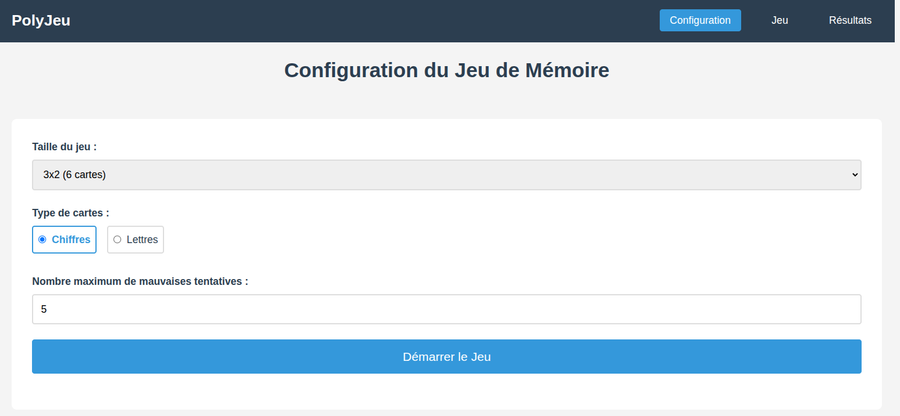
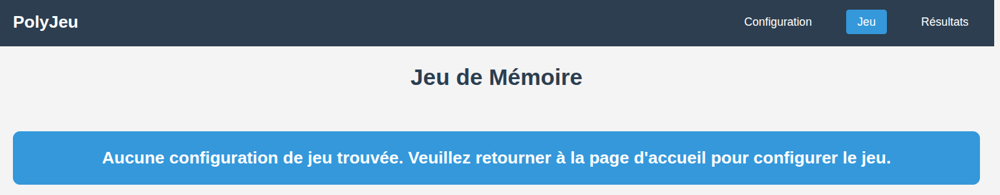
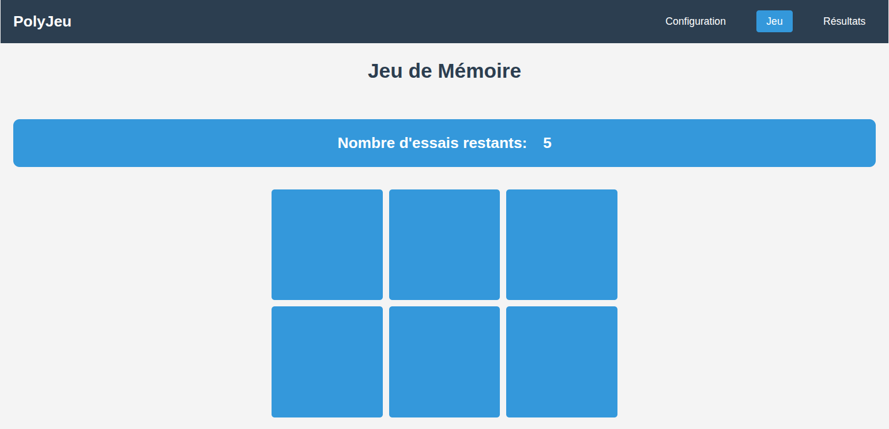
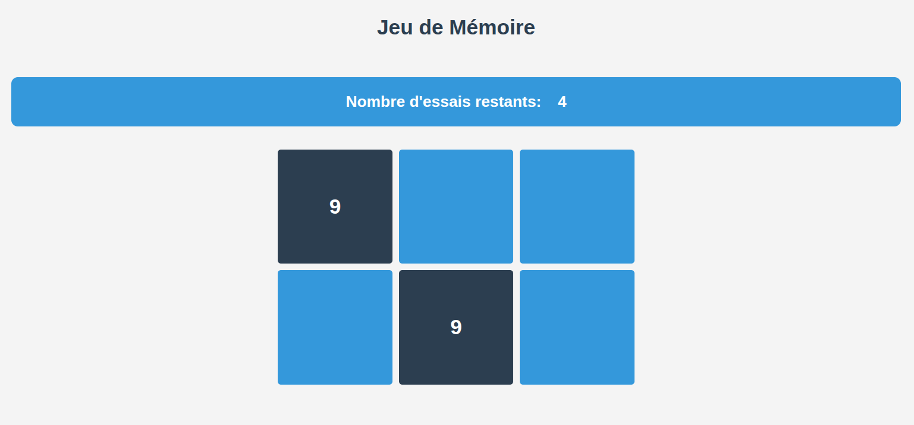
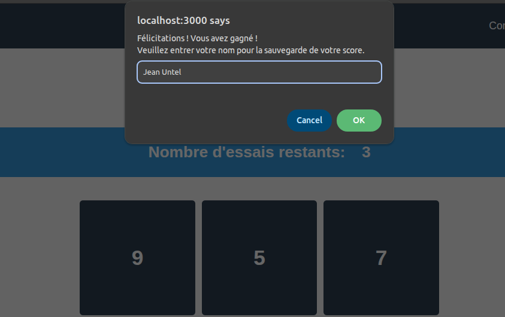
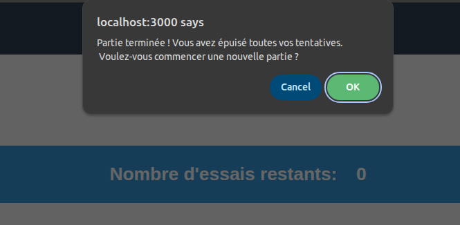
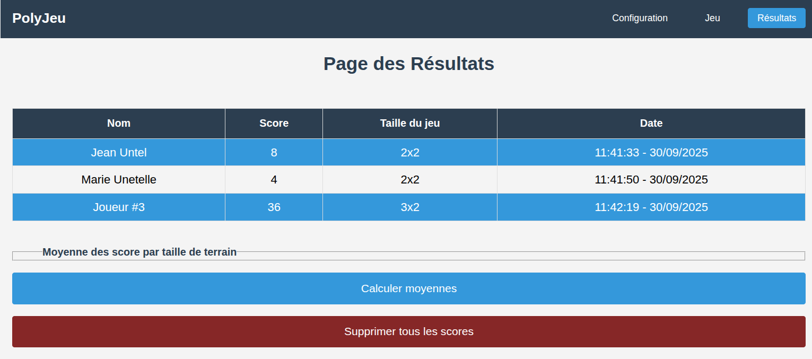
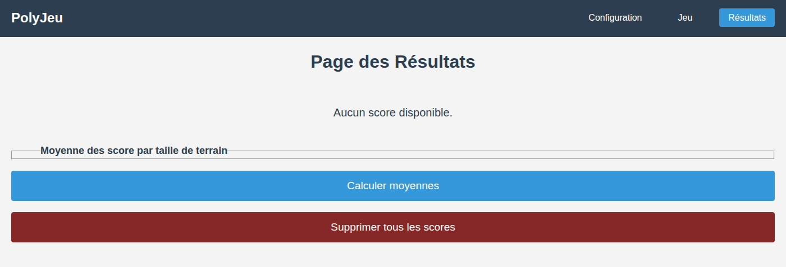
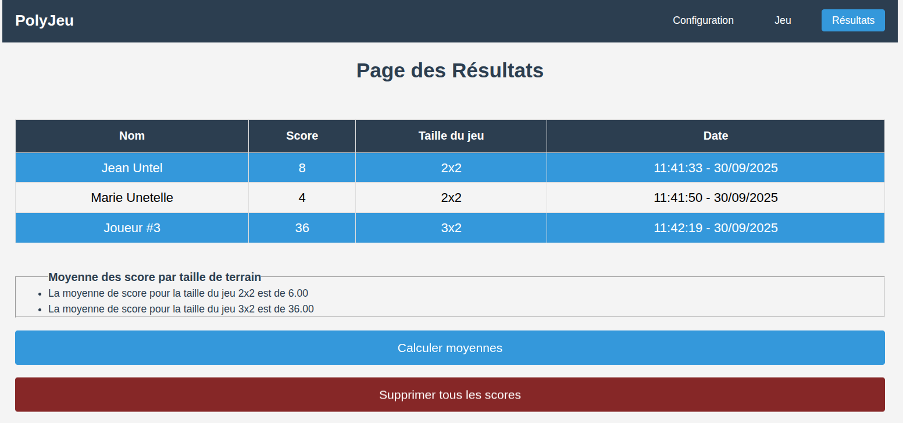

[](https://classroom.github.com/a/EtZ_0D6s)
# TP3 PolyJeu

Le but de ce travail est de vous introduire à la manipulation du DOM ainsi qu'approfondir vos connaissances en validation et vérification logicielle. Vous allez explorer la gestion des événements dans une page web ainsi que la communication entre plusieurs pages différentes sous le même domaine.

## Installation des librairies nécessaires

Pour installer les dépendances nécessaires, lancez la commande `npm ci` dans la racine du projet. Ceci installera toutes les librairies définies dans le fichier `package.json` avec les versions exactes définies dans `package-lock.json`.

## Exécution des tests

Consultez le fichier [TESTS.MD](./TESTS.MD) pour plus d'informations sur les tests du travail. Vous aurez à implémenter du code à partir de certains tests fournis dans ce travail pratique ainsi que des tests supplémentaires pour valider le code fourni.

## Déploiement local

Vous pouvez faire un déploiement local de votre site avec l'outil `http-server`. Si vous lancez la commande `npm start` dans la racine du projet, un serveur HTTP statique sera déployé sur votre machine et votre site sera accessible sur l'adresse `localhost:3000` ou `<votre-adresse-IP>:3000`. La sortie dans le terminal vous donnera l'adresse exacte d'accès.

## Description du travail à compléter

Le but de ce travail pratique est d'implémenter un jeu de mémoire sur plusieurs pages web. Le jeu de mémoire consiste à retrouver des paires de cartes identiques dans une grille de cartes retournées. Le joueur retourne deux cartes à la fois et si les cartes sont identiques, elles restent découvertes. Sinon, elles sont retournées face cachée. Le jeu se termine lorsque toutes les paires ont été découvertes ou lorsque le joueur n'a plus de tentatives restantes. Un utilisateur peut configurer le jeu dans la page principale ainsi que consulter un historique des parties jouées dans une page dédiée.

La logique du jeu vous est fournie dans la classe [GameManager](./src/assets/js/managers/gameManager.js) et la logique de calcul des résultats dans la classe [ScoreManager](./src/assets/js/managers/scoreManager.js). Vous devez implémenter l'interface utilisateur ainsi que la communication entre les différentes pages.

Vous devez également compléter plusieurs tests de différents types pour l'ensemble du logiciel. Cette étape peut être faite en parallèle avec le développement des fonctionnalités ou par la suite.

#### Code fourni

Notez que le CSS et HTML des pages vous est fourni. Vous n'aurez pas besoin à modifier ces fichiers, mais vous aurez à générer dynamiquement le contenu de certaines sections dans ces pages. Un exemple du résultat statique vous est fourni dans le code de départ.

Vous n'aurez pas à modifier la classe `GameManager`, mais vous aurez à corriger un défaut dans la classe `ScoreManager` (voir plus bas). Les fichiers d'initialisation de chaque page ([index.js](./src/assets/js/index.js), [game.js](./src/assets/js/game.js) et [result.js](./src/assets/js/result.js)) vous sont fournis et n'ont pas à être modifiés.

**Note** : on vous demande d'utiliser les constantes `GAME_CONFIG_KEY` et `SCORE_KEY` définies dans le fichier [constants.js](./src/assets/js/utils/constants.js) pour les clés à utiliser dans le `Storage` du navigateur.

### Gestion de la sauvegarde

Vous devez utiliser les objets `Storage` de votre navigateur pour sauvegarder les informations nécessaires entre les différentes pages. Vous devez compléter la classe [StoreService](./src/assets/js/services/storeService.js) pour gérer la sauvegarde et la récupération des données dans le `Storage` du navigateur. Consultez les commentaires `TODO` dans la classe pour comprendre le fonctionnement attendu.

Des tests unitaires sont disponibles dans le fichier [storeService.test.js](./tests/jest/storeService.test.js) pour vous aider dans votre développement.

### Page de configuration (index.html)

Cette page vous permet de configurer une nouvelle partie avec les options suivantes :
- Taille de jeu (2x2, 3x2 et 4x3)
- Type de cartes (chiffres ou lettres)
- Nombre de tentatives disponibles (entre 0 et 50)

Lorsque l'utilisateur clique sur le bouton "Démarrer le Jeu", la configuration est sauvegardée (si valide) pour la durée de la session et l'utilisateur est automatiquement redirigé vers la page de jeu pour commencer une nouvelle partie avec la configuration choisie.

Si une configuration de jeu a déjà été sauvegardée durant la session en cours, les options du formulaire doivent être initialisées avec cette configuration. Sinon, les valeurs par défauts sont affichées.

Une configuration possède le format suivant :
```json
{
  "gameSize": "3x2",
  "cardType": "numbers",
  "maxAttempts": 10
}
```

Vous devez compléter la classe [ConfigurationInterfaceManager](./src/assets/js/managers/configurationInterfaceManager.js). Les seules fonctions obligatoires sont `initializeConfigurationPage` et `generateConfig` qui doivent retourner un objet tel que décrit plus haut. Vous êtes libres d'ajouter des fonctions supplémentaires pour compléter la fonctionnalité de la page.

Des tests sont disponibles dans le fichier [index.cy.js](./tests/cypress/e2e/index.cy.js) et [index.test.js](./tests/jest/index.test.js) pour vous aider dans votre développement.

Voici un exemple d'une configuration valide : 
<div style="display:flex; justify-content:center; width:100%; margin:20px">
    
</div>

### Page de jeu (game.html)

La page de jeu est accédée à travers le bouton "Démarrer le Jeu" de la page principale ou le lien "Jeu" dans l'entête du site. Si aucune configuration de jeu n'est présente, un message est affiché pour inviter l'utilisateur à retourner à la page principale pour configurer une nouvelle partie.

<div style="display:flex; justify-content:center; width:100%; margin:20px">
    
</div>

Si une configuration est présente, une nouvelle partie est initialisée avec cette configuration.

<div style="display:flex; justify-content:center; width:100%; margin:20px">
    
</div>

Le jeu est joué en cliquant sur les cartes. Seulement le clic du bouton gauche de la souris est permis et tout clic avec le bouton droit est ignoré. Tout clic sur une carte déjà retournée est aussi ignoré.

Lorsqu'une carte est cliquée, elle est retournée face visible. Si deux cartes sont retournées, elles sont comparées. Si elles sont identiques, elles restent découvertes. Sinon, elles sont retournées face cachée après un délai de 1 seconde. Le joueur perd une tentative à chaque fois que deux cartes sont retournées et qu'elles ne sont pas identiques jusqu'à épuisement des tentatives disponibles.

Voici un exemple d'une partie en cours avec une paire découverte et une mauvaise tentative :
<div style="display:flex; justify-content:center; width:100%; margin:20px">
    
</div>

Chaque carte est d'une forme carrée de `175px * 175px` (constante `CARD_SIZE` dans le fichier [consts.js](./src/assets/js/utils/consts.js)) et la grille de cartes est centrée horizontalement dans la page.

Une carte est représentée par la structure HTML suivante où le "devant" de la carte est vide et le "derrière" contient la valeur (en fonction de la configuration). L'attribut CSS `opacity` permet de cacher ou afficher chaque face de la carte :
```html
<div class="game-card-content" data-hidden="true" data-index="0">
    <div class="game-card-front"></div>
    <div class="game-card-back">9</div>
</div>
```

Notez l'utilisation de `data-*` pour les informations dynamiques de chaque carte.

Vous devez générer dynamiquement la grille de cartes en fonction de la configuration choisie et gérer les interactions de l'utilisateur avec le jeu.

La partie se termine lorsque toutes les paires ont été découvertes ou lorsque le joueur n'a plus de tentatives restantes. En cas de succès, le joueur se fait demander son nom pour sauvegarder son score et est redirigé vers la page des résultats après son entrée. Son nom et son score sont sauvegardés de manière permanente dans le `Storage` du navigateur.

<div style="display:flex; justify-content:center; width:100%; margin:20px">
    
</div>

En cas d'échec, un message invite le joueur à recommencer une nouvelle partie ou non. Si le joueur accepte, il reste sur la même page et le jeu recommence à nouveau. Sinon, il est redirigé vers la page principale.

<div style="display:flex; justify-content:center; width:100%; margin:20px">
    
</div>

La logique de jeu vous est fournie dans la classe [GameManager](./src/assets/js/managers/gameManager.js) et il est conseillé de vous familiariser son fonctionnement. 

Vous devez compléter la classe [GameInterfaceManager](./src/assets/js/managers/gameInterfaceManager.js) pour implémenter l'interface utilisateur de la page de jeu. Notez que la fonction `#handleUnmatchedPair` qui inverse les cartes en cas de non-correspondance après 1 seconde est déjà implémentée pour vous. Lisez les commentaires `TODO` pour comprendre le fonctionnement attendu de la classe. Vous êtes libres d'ajouter des fonctions supplémentaires pour compléter la fonctionnalité de la page.

Des tests d'interface sont disponibles dans le fichier [game.cy.js](./tests/cypress/e2e/game.cy.js) pour vous aider.

### Validation et vérification de la logique de jeu

La classe GameManager est implémentée, mais pas testée. Vous devez compléter les tests unitaires dans le fichier [gameManager.test.js](./tests/jest/gameManager.test.js) pour valider et vérifier la logique de jeu. Vous devez ajouter les tests manquants pour atteindre une couverture de code de 100%. Vous pouvez utiliser les tests fournis comme exemples.

### Page des résultats (results.html)

Cette page permet d'afficher les résultats des parties gagnées. Elle est accédé à travers le lien "Résultats" dans l'entête du site ou à la fin d'une partie gagnée.

Les résultats sont affichés dans une table HTML avec des entêtes prédéfinies. Le format des résultats est défini lors de la sauvegarde du score en fin de partie.

Voici un exemple après 3 parties gagnées :
<div style="display:flex; justify-content:center; width:100%; margin:20px">
    
</div>

La mise en forme de la date doit être faite à l'aide de la fonction `formatDate` disponible dans le fichier [helper.js](./src/assets/js/utils/helper.js).

Si aucun résultat n'est disponible, un message est affiché :
<div style="display:flex; justify-content:center; width:100%; margin:20px">
    
</div>

La page contient également 2 boutons en bas de la liste de résultats.

Le bouton "Supprimer tous les scores" permet de supprimer les données sauvegardées et mettre à jour l'affichage.

Le bouton "Calculer moyennes" permet de calculer les moyennes des scores par taille de jeu et les afficher dans une liste dans des balises `<li>`. Voici un exemple :
<div style="display:flex; justify-content:center; width:100%; margin:20px">
    
</div>

**Note** : le code fourni pour le calcul des moyennes est incorrect. Les captures d'écran présentent la version corrigée. Vous devez trouver le problème et le corriger à l'aide des tests unitaires. Voir la section suivante.

Vous devez compléter la classe [ResultsInterfaceManager](./src/assets/js/managers/resultInterfaceManager.js) pour implémenter l'interface utilisateur de la page des résultats. Lisez les commentaires `TODO` pour comprendre le fonctionnement attendu de la classe. Vous êtes libres d'ajouter des fonctions supplémentaires pour compléter la fonctionnalité de la page.

Des tests d'interface sont disponibles dans le fichier [results.cy.js](./tests/cypress/e2e/results.cy.js) pour vous aider. Vous devez compléter les tests marqués `TODO` pour valider certains aspects de l'interface.


### Calcul du score et correction de la classe ScoreManager

La classe [ScoreManager](./src/assets/js/managers/scoreManager.js) est responsable du calcul et de la gestion des scores des joueurs. La fonction `getMultiplicativeFactor` permet de calculer un facteur de bonus en fonction de la taille de jeu. Le code est fourni, mais vous devez ajouter des tests unitaires dans le fichier [scoreManager.test.js](./tests/jest/scoreManager.test.js) pour valider son fonctionnement.

La fonction `computeAveragePerGameSize` calcule la moyenne des scores par taille de jeu. Le code est fourni, mais il est incorrect. Vous devez le corriger et ajouter des tests unitaires pour valider son fonctionnement.

## Test de bout en bout (E2E)

Afin de vérifier l'ensemble de votre système, vous devez compléter un test de bout en bout (_end to end_) dans le fichier [e2e.cy.js](./tests/cypress/e2e/e2e.cy.js). Le test doit couvrir le scénario suivant :
1. Aller à la page principale
2. Configurer une nouvelle partie de taille 2x2
3. Lancer la partie et gagner la partie
4. Vérifier que le score est sauvegardé et affiché dans la page des résultats

Ce test couvre le scénario principal d'utilisation de votre application. Vous pouvez ajouter d'autres tests E2E si vous le souhaitez.


# Fonctionnalité bonus

Dans la version de base, quitter la page de jeu et y revenir réinitialise la partie en cours. Pour une fonctionnalité bonus, vous devez implémenter la persistance de l'état de la partie en cours. Ainsi, si l'utilisateur quitte la page de jeu et y revient, il doit retrouver la partie là où il l'avait laissée. Ex : si l'utilisateur a déjà découvert 1 paire, il doit la retrouver découverte en revenant sur la page de jeu avec le même nombre de tentatives restantes. Si la configuration du jeu est modifiée dans la page principale, la partie en cours doit être réinitialisée et la nouvelle configuration doit être prise en compte. La sauvegarde de l'état de la partie doit persister à travers une fermeture complète du navigateur.

# Correction et remise

La grille de correction détaillée est disponible dans [CORRECTION.MD](./CORRECTION.MD). Le navigateur `Chrome` sera utilisé pour l'évaluation de votre travail. L'ensemble des tests fournis doivent réussir lors de votre remise. Les tests ajoutés par l'équipe doivent aussi réussir.

Le travail doit être remis au plus tard le vendredi 31 octobre à 23:59 sur l'entrepôt Git de votre équipe. Le nom de votre entrepôt Git doit avoir le nom suivant : `tp3-matricule1-matricule2` avec les matricules des membres de l’équipe. Une pénalité de **10%** sera appliquée en cas de non-respect de cette nomenclature.

**Aucun retard ne sera accepté** pour la remise. En cas de retard, la note sera de 0.