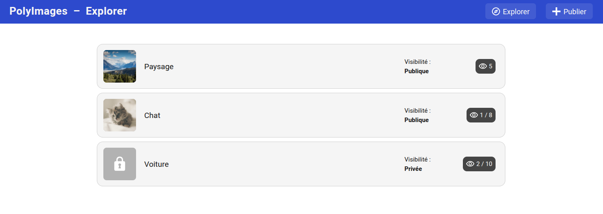
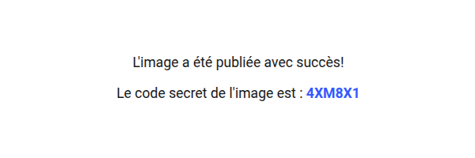
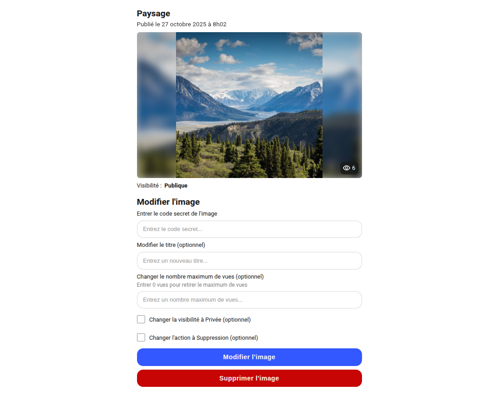
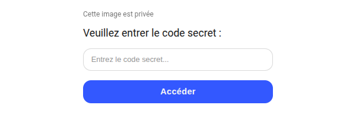
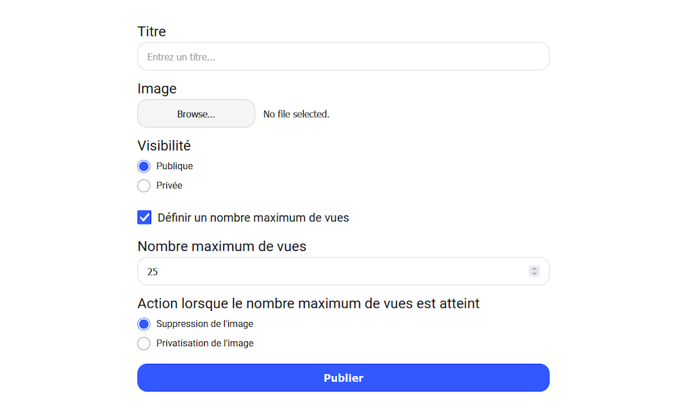

[](https://classroom.github.com/a/ASyphS8B)
# TP4 PolyImages

Le but de ce travail est de vous introduire au concept de communication entre un logiciel client (**frontend**) et un serveur dynamique (**backend**) à travers un protocole de communication (**HTTP**).

Le frontend est la partie visible de l’application, dont le code est exécuté directement sur l’ordinateur de l’utilisateur et gère l’affichage ainsi que les interactions avec l’interface web. Le backend quant à lui, correspond au code qui est exécuté sur un serveur, responsable du stockage des données et de la logique interne.

Dans ce travail, vous serez amenés à implémenter des routes qui traitent des **requêtes HTTP** suivant la bonne sémantique du protocole tel que vu en classe. Vous allez également devoir implémenter la vérification d’un code secret afin d’assurer la sécurité des données.

## Serveurs statique et dynamique

L’entrepôt fourni contient deux projets distincts :

- Le dossier `site`, qui correspond à la partie **frontend** (site web servi par un serveur statique)

- Le dossier `server`, qui correspond à la partie **backend** (serveur dynamique)

Ces deux projets possèdent des dépendances différentes. Vous devez donc exécuter la commande **`npm ci`** **dans chacun des deux dossiers**, afin d'installer les librairies définies dans les fichiers [site/package.json](./site/package.json) et [server/package.json](./server/package.json).

## Déploiement local

Pour effectuer un déploiement local de votre site web, vous devez exécuter la commande `npm start` dans les dossiers `site` et `server`, dans deux terminaux différents en même temps. Le serveur statique sera alors accessible à l'adresse `localhost:3000` et le serveur dynamique sera accessible à l'adresse `localhost:5020`.

## Code fourni

Tout le code **HTML**, **CSS** et le code **JavaScript** manipulant le DOM vous est déjà fourni. Vous n’avez donc pas à concevoir l’interface ni à gérer toutes les interactions visuelles du site sauf celles indiquées par un **TODO**.

Votre travail portera sur la **logique des images**, l’implémentation des **routes HTTP**, ainsi que l'exécution des **requêtes HTTP** effectuées depuis le site web pour échanger des données avec le serveur.

## Exécution des tests

Vous trouverez des tests pour le serveur dynamique dans le dossier [server/tests](./server/tests/), mais aucun test pour le serveur statique ne vous est fourni pour ce travail. Pour exécuter ces tests, entrez la commande **`npm test`** depuis le dossier **`server`**.

Consultez le fichier [TESTS.MD](./TESTS.MD) pour plus d'informations sur les tests fournis.

# Description du travail à compléter

Le site web PolyImages est une bibliothèque d'images sur laquelle les utilisateurs peuvent publier et consulter des images. 

La vue principale du site affiche toutes les images dans une liste avec leur prévisualisation (si publique), leur visibilité et le nombre de vues :
<div align="center" style="display:flex; justify-content:center; width:100%; margin:20px">
    
</div> 

Chaque image est enregistrée avec la structure suivante :

```json
{
    "id": "123456",
    "title": "Voiture",
    "filename": "123456_voiture.jpg",
    "secretCode": "ABC123",
    "status": "private",
    "createdAt": "2025-10-27T12:02:42.432Z",
    "views": 2,
    "maxViews": 10,
    "immediateDelete": true
},
```

Description des métadonnées d'une image :

- **id** : Identifiant unique associé à l'image, généré aléatoirement par le serveur lors de la publication de l'image
- **title** : Titre de la publication de l'image, choisi par l'utilisateur ayant publié l'image
- **filename** : Nom du fichier de l'image, déterminé par le serveur lors de la publication de l'image
- **secretCode** : Code secret utilisé pour modifier ou supprimer une image, aussi utilisé pour consulter une image privée
- **status** : Statut de la visibilité de l'image, soit `"public"` ou `"private"`
- **views** : Compteur du nombre de vues, est incrémenté de +1 à chaque nouvelle consultation de l'image
- **maxViews** : Nombre maximum de vues, si cette valeur est `null` il n'y a pas de maximum de vues
- **immediateDelete** : Booléen représentant l'action à effectuer lorsque le maximum de vues est atteint

### Nombre maximum de vues

Chaque fois qu'un utilisateur consulte la page d'une image, son **compteur de vues** doit être incrémenté de +1. Lorsque le **nombre maximum de vues** est atteint, l'image est soit privatisée, soit supprimée, dépendamment de son attribut `immediateDelete`.

Si `immediateDelete` est `true`, l'image doit être supprimée. Par contre, si `immediateDelete` est `false`, l'image doit passer d'un statut `public` à un statut `private`.

Cette configuration est faite à la publication initiale de l'image, mais peut être modifiée par la suite (voir les séctions plus bas).

### Code secret

Lorsqu'une image est publiée, le serveur doit générer un **code secret** comportant 6 caractères, qui doit être affiché à l'utilisateur venant de publier l'image : 

<div align="center" style="display:flex; justify-content:center; width:100%; margin:20px">
    
</div> 

Tout utilisateur en possession de ce **code secret** est en mesure de modifier ou de supprimer l'image. Sans la connaissance de ce **code secret**, il devrait être impossible pour un utilisateur de modifier ou de supprimer l'image.

Les images ayant un `status` public peuvent être consultées par tous les utilisateurs. Cependant, pour les images ayant un `status` privé, le **code secret** est nécessaire pour les consulter.

## Gestion d'une image

Un clic sur une rangée dans la vue principale amène l'utilisateur sur la page de l'image spécifique. Si l'image est publique, la page est affichée directement : 

<div align="center" style="display:flex; justify-content:center; width:100%; margin:20px">
    
</div> 

Si l'image est privée, un champ de saisi pour le code secret est plutôt affiché et la page est affichée seulement si le bon code est fourni : 
<div align="center" style="display:flex; justify-content:center; width:100%; margin:20px">
    
</div> 

La page permet de modifier la publication : titre, nombre maximum de vues, action en cas de nombre maximum atteint, ou de supprimer l'image.

Si l'image a été accédée sans code (publique), le code doit être fourni pour pouvoir demander les modifications ou la suppresion. Sinon, le 1er champ du formulaire doit être cachée, mais le code doit quand même être envoyé au serveur.

## Publication d'une nouvelle image

Une page dédiée permet de publier une image :  
<div align="center" style="display:flex; justify-content:center; width:100%; margin:20px">
    
</div> 

Il faut fournir un titre, une visibilité et (optionnellement) un nombre maximum de vues. Si fourni, il faut choisir l'action à effectuer : rendre l'image privée ou la supprimer. Si l'image est privée, l'action de supression doit être automatiquement choisie.

### Détails concernant le nombre maximum de vues

La privatisation ou la suppression d'une image dû au compteur de vues doit être déclenchée lorsque le nombre de vues devient égal au nombre maximum de vues. Cependant, l'utilisateur ayant déclenché cette privatisation ou suppression doit tout de même voir l'image apparaitre sur son écran.

**Exemple de comportement voulu** : Une image est à 4 / 5 vues. Un utilisateur consulte la page de l'image. Le nombre de vues passe à 5 / 5. L'image est affichée sur l'écran de l'utilisateur avec un nombre de vues de 5 / 5. L'image est aussitôt supprimée.

**Exemple de comportement non-voulu** : Une image est à 4 / 5 vues. Un utilisateur consulte la page de l'image. Le nombre de vues passe à 5 / 5. L'image est aussitôt supprimée. L'image n'est pas affichée sur l'écran de l'utilisateur puisqu'elle n'existe plus.

Pour cette raison, l'incrémentation du compteur de vues de l'image doit être faite dans la fonction `ImagesManager.getImageById()`, mais la comparaison entre `views` et `maxView` doit être faite dans la fonction `ImagesManager.getImageFileById()`.

Également, lorsque le nombre maximum de vues d'une image est modifié de façon à devenir plus petit ou égal à son nombre de vues, la privatisation ou suppression doit être faite instantanément.

## Logique des images

Vous devez compléter les classes [ImagesManager](./server/managers/imagesManager.js) et [AdminManager](./server/managers/adminManager.js) qui contiennent les fonctions permettant de consulter, ajouter, modifier et supprimer une image.

Fiez-vous à la documentation présente au-dessus de chaque fonction, expliquant son contenu, ses paramètres et sa valeur de retour. Vous êtes libres d'ajouter des fonctions supplémentaires pour vous aider ou pour réduire la duplication de code.

Vous devez utiliser le [FileSystemManager](./server/managers/fileSystemManager.js), déjà implémenté pour vous, afin de sauvegarder les images et leurs métadonnées. Consultez la fonction `ImagesManager.getAllImages()` afin de voir un exemple d'utilisation du `FileSystemManager`.

Des tests sont disponibles dans les fichiers [imagesManager.test.js](./server/tests/imagesManager.test.js) et [adminManager.test.js](./server/tests/adminManager.test.js) pour vous aider dans votre développement.

## Implémentation des routes HTTP du serveur dynamique

Vous devez compléter le fichier [server.js](./server/server.js) en ajoutant les bons middlewares pour accepter les requêtes de plusieurs origines ainsi que des requêtes avec des fichiers. Vous devez aussi configurer les routeurs `imagesRouter` et `adminRouter` adéquatement.

Également, vous devez compléter les classes [ImagesRouter](./server/routes/imagesRouter.js) et [AdminRouter](./server/routes/adminRouter.js) en ajoutant 4 et 1 routes, respectivement. Ces routes doivent faire appel aux fonctions des classes [ImagesManager](./server/managers/imagesManager.js) et [AdminManager](./server/managers/adminManager.js), tel que mentionné dans les TODOs présents dans les fichiers des routeurs. Servez-vous des deux routes déjà implémentées comme exemples, soit `GET /images` et `GET /images/static/:id`, afin de vous guider dans la création des nouvelles routes.

Il est de votre responsabilité de choisir les points de terminaison (endpoints) et les méthodes (GET, POST, PUT, PATCH, DELETE) appropriées. Vos choix de points de terminaison et de méthodes doivent respecter la **sémantique du protocole HTTP**, telle que vue en classe. Pour réviser ces principes, vous pouvez consulter la [documentation de Postman](https://blog.postman.com/what-are-http-methods) ou bien la [documentation de restfulapi.net](https://restfulapi.net/http-methods).

**Note importante** : Le choix des points de terminaison et des méthodes, ainsi que l'implémentation des routes, constitue une partie majeure du travail, valant 4 points sur 20 dans le [CORRECTION.MD](./CORRECTION.MD). Vous devriez prendre la peine de bien y réfléchir et de bien vous informer en ligne.

### Route d'administration

Le routeur [AdminRouter](./server/routes/adminRouter.js) possède 1 seule route qui permet de réinitialiser la _base de données_ du système. Un appel à cette route met a jour toutes les images avec un statut public, aucune vue, supprime les limites de vues et désactive l'option de suppression immediate.

Il n'y a pas d'élément visuel lié à cette route dans le site web, mais vous pouvez envoyer une requête à l'aide d'un outil comme _Postman_ ou _ThunderClient_ pendant le développement.

## Implémentation des requêtes HTTP du site web

Maintenant que vous avez créé les routes HTTP du serveur dynamique, vous allez devoir modifier les fonctions du fichier [request.js](./site/src/assets/js/request.js) du site web pour effectuer des requêtes HTTP à ces routes, à l'aide de l'API `fetch()`.

La fonction `getAllImages()` vous est fournie à titre d'exemple.

Vous devez également vous assurer que l'interface utilisateur fonctionne correctement et que les fonctionnalités ont bel et bien les comportements attendus. Consultez les endroits dans le code ayant un **TODO** pour voir les éléments à compléter.

## Documentation de l'API

Dans un contexte d’entreprise, il est fréquent d’avoir une documentation qui explique les différentes routes disponibles pour un serveur HTTP. Que ce soit pour une utilisation au sein de l'entreprise ou pour la publication externe afin que des acteurs tiers puissent effectuer des requêtes HTTP, ces documentations comprennent :

- Une description de la route
- Le point de terminaison (endpoint)
- La méthode HTTP
- Le contenu à envoyer au serveur (payload)
- Les codes de retour attendus
- Le contenu attendu dans la réponse du serveur (souvent en JSON)

Voici un exemple de [documentation d’une API publique d’une grande entreprise](https://docs.binance.us/?python#trade-data).

### Swagger

Dans le cadre de ce travail, vous allez devoir utiliser **Swagger** comme outil de documentation pour votre serveur. Vous pouvez consulter la documentation de votre API en accédant à l'URL `localhost:5020/api` dans votre navigateur web.

Voici un exemple de documentation Swagger pour la route `GET /images` :

```js
/**
 * @swagger
 * /images:
 *   get:
 *     tags:
 *       - Images
 *     summary: Récupère toutes les images
 *     description: Retourne la liste des images publiques et privées en excluant leur code secret
 *     responses:
 *       200:
 *         description: Liste des images récupérée avec succès
 *       500:
 *         description: Erreur interne du serveur
 */
this.router.get('/', async (req, res) => {
    try {
        const images = await this.imagesManager.getAllImages();
        res.json(images);
    } catch (e) {
        res.status(HTTP_STATUS.INTERNAL_SERVER_ERROR).json({ error: e.message });
    }
});
```

Vous devez modifier les fichiers [imagesRouter.js](./server/routes/imagesRouter.js) et [adminRouter.js](./server/routes/adminRouter.js) afin d'ajouter une documentation Swagger aux différentes routes que vous avez créées.

Pour vous aider, fiez-vous à la documentation des routes déjà implémentées, soit `GET /images` et `GET /images/static/:id`. Vous pouvez également consulter des ressources en ligne, telle que la [documentation officielle de Swagger](https://swagger.io/specification) ainsi que [l'exemple du cours](https://github.com/LOG2440/Cours-8-AJAX/blob/master/server/router.js).

# Fonctionnalité bonus

Dans la version de base, le formulaire du site web présente des validations, telles qu'un nombre de caractères maximum pour le titre.

```html
<input name="title" id="title" type="text" minlength="1" maxlength="50" required>
```

Cependant, il est important d'avoir ces validations du côté du serveur dynamique également. Pour la fonctionnalité bonus, vous devez vous assurer qu'il est impossible pour un utilisateur malveillant d'envoyer une mauvaise requête HTTP qui briserait le système de gestion des images.

Vous devez faire en sorte que les routes renvoient une erreur 400 (Bad request) si la requête est invalide :

- Tous les attributs obligatoires doivent être présents
- Le type de chaque attribut doit être vérifié (par exemple `immediateDelete` doit être un booléen)
- Le statut doit être une string de valeur `"public"` ou `"private"`
- Le titre doit avoir entre 1 et 50 caractères
- Le nombre maximum de vues doit être entre 1 et 999
- Si l'image est privée et que `maxViews` n'est pas `null`, alors `immediateDelete` ne peut pas être `false`
- La taille maximale d'une image est de 1 MB
- Le fichier de l'image est bel et bien une image (.jpg, .png, etc)

# Correction et remise

La grille de correction détaillée est disponible dans le fichier [CORRECTION.MD](./CORRECTION.MD). Le navigateur `Chrome` sera utilisé pour l'évaluation de votre travail.

Lors de votre remise, l'ensemble des tests fournis doit réussir.

Aucune erreur ne doit être détectée lors de l'exécution de la commande `npm run lint`, aussi bien dans le dossier `site` que dans le dossier `server`.

Le travail doit être remis au plus tard le vendredi 14 novembre à 23:59 sur l'entrepôt Git de votre équipe. Le nom de votre entrepôt Git doit avoir le nom suivant : `tp4-matricule1-matricule2` avec les matricules des membres de l’équipe. Une pénalité de **10%** sera appliquée en cas de non-respect de cette nomenclature.

**Aucun retard ne sera accepté** pour la remise. En cas de retard, la note sera de 0.
