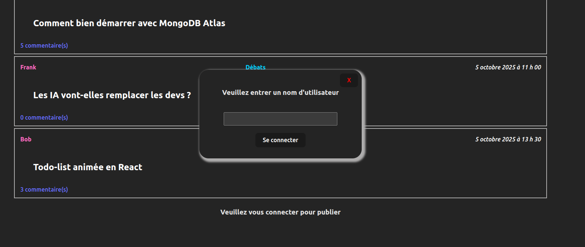
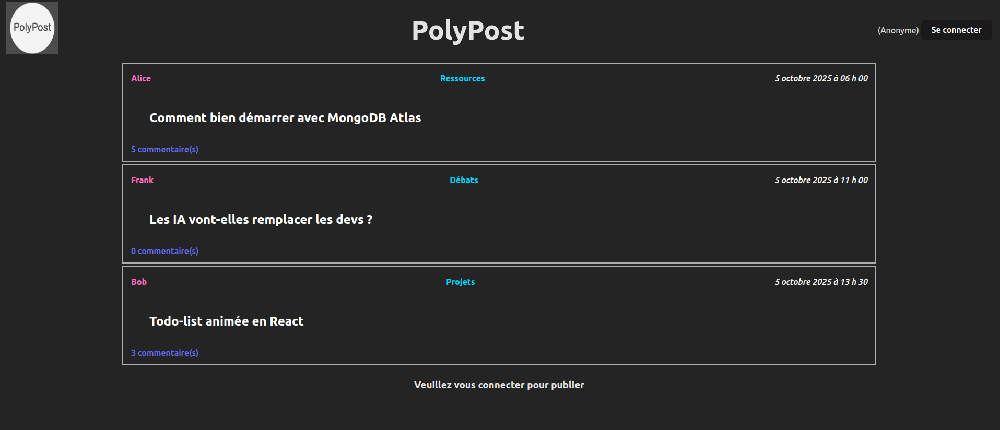
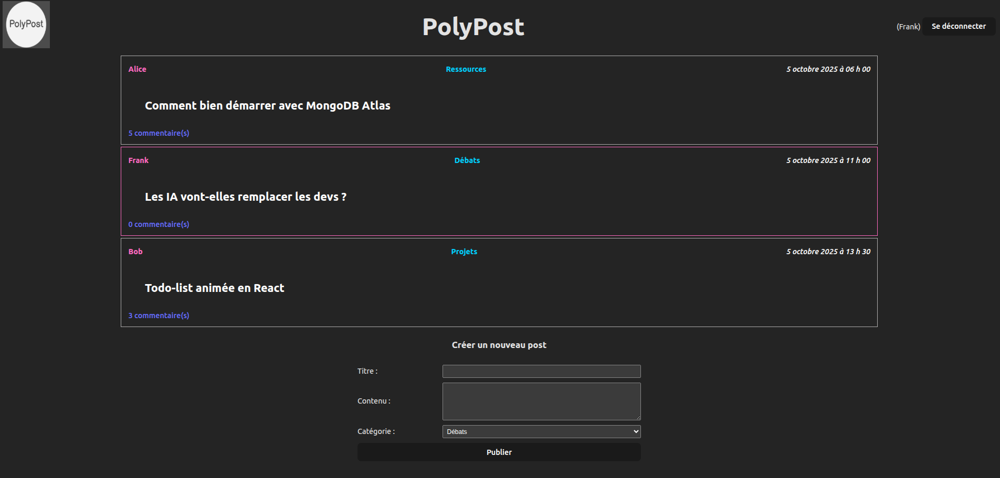
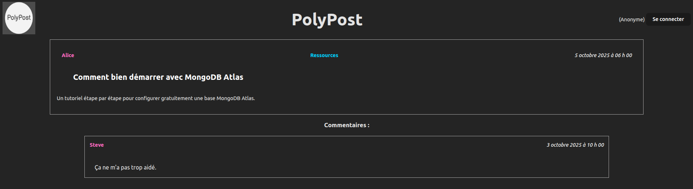
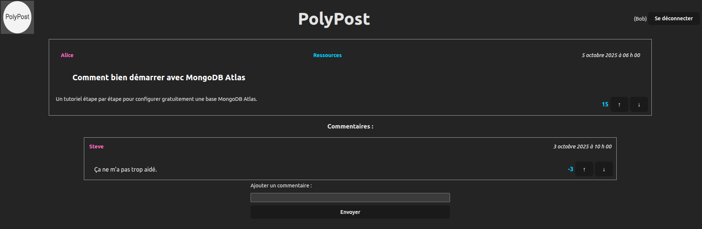
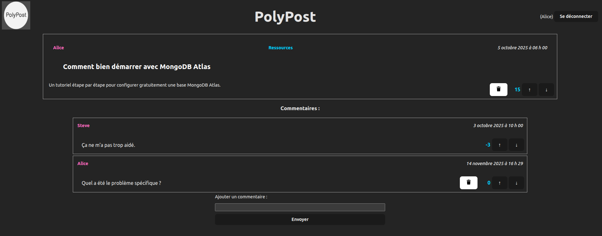

[](https://classroom.github.com/a/QHMq-bZt)
# TP5 PolyPost

# Mise en contexte et objectifs du travail pratique

Le but de ce travail pratique est de vous familiariser avec le développement d'une application web _full stack_ utilisant une base de données pour assurer la persistance des données. Pour ce faire, vous utiliserez la librairie _React_ pour le côté client et vous vous connecterez à une base de données _MongoDB_ à partir d'un environnement _NodeJS_ pour le côté serveur.

L'application à compléter est une preuve de concept d'un système de forum en ligne qui permet à l'utilisateur de consulter des publications organisées par catégorie, d’en créer de nouvelles, de commenter des publications existantes et de réagir à ces publications et commentaires (+1 ou −1). Les utilisateurs peuvent entrer un pseudonyme pour publier et commenter, mais il n’y a pas de système d’authentification complet. L'application est déjà partiellement développée et vous devez compléter les fonctionnalités manquantes.

Le code source fourni contient deux applications distinctes, soit une application ReactJS (répertoire `site-web`) ainsi qu'une application NodeJS/Express (répertoire `server`). L'application React est constituée de composantes qui se retrouvent dans les répertoires `components` et `pages`.

Le serveur, pour sa part, comprend un routeur, des services et des données par défaut. C'est le fichier `server.js` qui sera exécuté au lancement du serveur.

## Configuration de la base de données

Vous devez configurer une instance MongoDB pour la persistance de vos données. Vous devez utiliser le service [Atlas Databse](https://www.mongodb.com/products/platform/atlas-database).

**Vous devez configurer votre instance avant de pouvoir effectuer le travail demandé**. Un guide pour la configuration d'instances MongoDB avec Cloud Atlas est disponible sur le projet [GitHub du cours](https://github.com/LOG2440/Cours-11-MongoDB/blob/master/README.MD) de l'exemple sur MongoDB présenté en classe.

Le fichier [env.js](./server/utils/env.js) contient les constantes avec les informations de connexion à votre instance MongoDB. Vous devez les remplacer avec les bonnes valeurs de votre propre instance. 
**Important** : Assurez-vous de remettre le fichier `env.js` avec les bonnes valeurs avant de remettre votre travail.

## Installation des librairies nécessaires

Pour installer les dépendances nécessaires, lancez la commande `npm ci` dans la racine de chaque application (et donc deux fois au total). Ceci installera toutes les librairies définies dans le fichier `package-lock.json`.

## Déploiement local

Lors du développement, vous pouvez faire un déploiement local d'un serveur statique qui servira votre site web et de votre serveur dynamique avec la commande `npm start`. Notez bien qu'il faut exécuter la commande à la racine de chaque application (dans `/site-web` et `/server`) dans deux consoles distinctes afin que les deux fonctionnent en parallèle.

Le serveur statique sera déployé à l'adresse `localhost:3000` (ou `<votre-adresse IP>:3000`). Le serveur dynamique sera déployé à l'adresse `localhost:5020` et commencera à écouter le port 5020.

Dans le cas du projet _React_, une étape de transpilation est nécessaire pour convertir le code source `JSX` en code `JavaScript` standard. Cette étape est automatiquement effectuée avant le lancement du serveur de développement avec la commande `npm start`.

## Description du travail à compléter

Il est conseillé de lire l'ensemble du travail demandé et d'implémenter les fonctionnalités côté serveur en premier avant de vous attaquer au site web. Un ensemble de tests vous est fourni pour valider le bon fonctionnement de votre serveur. Pour plus d'informations, consultez le fichier [TESTS.MD](TESTS.MD).

**Note** : nous vous conseillons de commencer par l'implémentation de la logique d'interaction avec la base de données dans le serveur avant de vous attaquer aux fonctionnalités du site web. Vous pouvez tester le fonctionnement de votre serveur à l'aide des tests fournis ou à travers l'API REST fournie.

## Format des données et les données initiales

Consultez le fichier [posts.json](./server/data/posts.json) pour voir les données initiales à utiliser.

Une publication a un identifiant unique, un titre, un contenu, une catégorie, un auteur, un nombre de réactions, une date de création et une liste de commentaires :
```json
{
  "id": 1,
  "title": "Comment bien démarrer avec MongoDB Atlas",
  "content": "Un tutoriel étape par étape pour configurer gratuitement une base MongoDB Atlas.",
  "author": "Alice",
  "category": "Ressources",
  "reactions": 15,
  "comments": [
    {
      "id": 1,
      "author": "Steve",
      "content": "Ça ne m'a pas trop aidé.",
      "reactions": 0,
      "date": "2025-10-03T14:00:00Z"
    }
  ],
  "date": "2025-10-05T10:00:00Z"
}
```

Un commentaire est associé à une publication et comprend un identifiant unique dans le contexte de la publication, un auteur, un contenu, un nombre de réactions et une date de création :
```json
{
  "id": 1,
  "author": "Steve",
  "content": "Ça ne m'a pas trop aidé.",
  "reactions": 0,
  "date": "2025-10-03T14:00:00Z"
}
```

Un utilisateur a simplement un nom d'utilisateur :
```json
{
  "username": "Alice"
}
```

Il n'y a pas de notions d'état connecté ou déconnecté dans la base de données. Un utilisateur est simplement une entrée dans la collection `USERS`.

# Serveur dynamique

Vous devez établir la communication avec une base de données MongoDB à partir de votre serveur dynamique. Pour ce TP, on vous demande de placer les différentes données dans 2 collections séparées nommées `POSTS` et `USERS` (Voir le fichier [env.js](./server/utils/env.js) pour les noms des collections).

Lors du lancement du serveur dans server.js, celui-ci se connecte à la base de données et ajoute les données initiales dans la collection POSTS, seulement si la collection est vide. Initialement il n'y a aucun utilisateur dans le système. Ceci vous permettra d'avoir des données initiales avec lesquelles tester votre système.

Vous devez implémenter les fonctionnalités présentes dans [PostService](./server/services/post.service.js), [UserService](./server/services/user.service.js) et [DatabaseService](./server/services/database.service.js) qui représentent les services principaux dans votre système.

Les routeurs [Post](./server/routes/post.js) et [User](./server/routes/user.js) sont implémentés pour vous, et font appel aux fonctions que vous aurez à implémenter. Dans les deux cas, une route spéciale `DELETE /reset` est disponible pour réinitialiser la base de données aux données initiales. Ceci sera utile pour votre développement. Il n'y aura pas d'éléments dans le site web qui font appel à cette route, mais vous pouvez utiliser un outil comme `Postman` ou `curl` pour l'appeler.

Vous devez utiliser le code pour comprendre comment les fonctions que vous implémenterez seront appelées. Vous devez compléter la configuration du serveur dans [server.js](./server/server.js) pour que la base de donnée soit peuplée avec les données initiales au premier lancement du serveur.

Chaque fonction à implémenter contient le mot clé **TODO** dans son en-tête. Les fonctions à compléter retournent des valeurs par défaut afin de permettre l’exécution du code, mais il est possible que vous devez modifier ces valeurs de retour.

## DatabaseService

Vous devez implémenter la fonction `populateDb` qui remplit une collection avec des données seulement si la collection est vide. Cette fonction est exécutée lors du lancement du serveur et remplit la base de données avec les valeurs du fichier JSON du répertoire `data` du projet. Si la collection de la base de données contient déjà des valeurs, aucune modification ne devra avoir lieu.

## UserService

Vous devez implémenter la fonction `createUser` qui ajoute un nouvel utilisateur dans la collection `USERS`. Si un utilisateur avec le même nom d'utilisateur existe déjà, aucune insertion ne doit être effectuée. Tel que décrit plus bas, il n'y a pas de système d'authentification complet dans ce projet. Un utilisateur est simplement une entrée dans la collection `USERS` et une demande de connexion avec un nom d'utilisateur inexistant crée automatiquement un nouvel utilisateur.

## PostService

Vous devez implémenter la majorité de la logique de cette classe qui s'occupe de la gestion des publications et des commentaires. Certains fonctions vous sont déjà fournies pour vous aider dans votre implémentation. Consultez les en-têtes des fonctions marqués par le mot clé **TODO** pour comprendre leur fonctionnement attendu.

Notez que la fonction `getAllPosts` ne doit pas retourner le contenu complet des publications, mais seulement les informations nécessaires pour l'affichage des aperçus dans la page principale du site web.

Au moment de la création, chaque publication et commentaire ont un nombre de réactions initialisé à 0 ainsi qu'une date de création correspondant à la date et l'heure courante. Cette date doit être déterminée par le serveur et non par le client.

Le service doit valider certaines contraintes au moment de la création ou suppression d'une nouvelle publication ou d'un commentaire :
- Une publication et un commentaire doivent être créées par un utilisateur (non anonyme).
- Une publication ou un commentaire ne peut être supprimé que par son auteur.
- Une publication ou un commentaire ne peut pas avoir un contenu ou titre et catégorie (si publication) vide.
- Une publication ne peut pas avoir le même auteur et titre qu'une publication existante.
- Un commentaire peut avoir le même auteur et contenu qu'un autre commentaire sur la même publication.


# Site Web

Le site web est composé de deux pages : la page principale et la page d'une publication (post) spécifique. Les deux pages partagent le même en-tête qui permet de s'authentifier en tant qu'utilisateur. En fonction de si un utilisateur est authentifié ou non, certaines fonctionnalités sont disponibles ou non.

Consultez les différentes composantes React et fichiers `.jsx`/`.js` pour identifier le code à compléter indiqué par le mot clé **TODO** aux endroits appropriés.

**Note** : certaines couleurs sont déclarées dans des variables CSS dans le fichier [index.css](./site-web/src/index.css). Vous pouvez les modifier si vous le souhaitez en autant que vous respectez les exigences de la grille de correction. Ces couleurs sont celles utilisées dans les captures d'écran ci-dessous.

## En-tête

L'en-tête est présent sur toutes les pages du site web et est implémenté dans la composante `Header`. Le logo dans le coin supérieur gauche permet de revenir à la page principale. Le bouton dans le coin supérieur droit permet à un utilisateur de s'authentifier en entrant un pseudonyme à travers une modale affichée à l'écran. Par défaut, l'utilisateur est `Anonyme` et ne peut pas publier ou commenter.

Une fois authentifié, le pseudonyme est affiché à côté du bouton de déconnexion. Il est possible de s'authentifier et de se déconnecter à partir de n'importe quelle page du site web. À la déconnexion, l'utilisateur redevient anonyme et la page en cours est mise à jour en fonction de ce changement d'état.

L'état de connexion persiste seulement durant la durée de vie du site web. Une fois le site web fermé ou rechargé, l'utilisateur redevient anonyme à la prochaine visite.

### Modale d'authentification

Le bouton de connexion (composante `LoginButton`) permet d'ouvrir une modale (composante `LoginComponent`) pour entrer un pseudonyme. Le bouton `Se connecter` envoi une requête au serveur pour s'authentifier avec le pseudonyme entré. Si le pseudonyme entré n'existe pas dans la base de données, un nouvel utilisateur est créé automatiquement. Le bouton `X` dans le coin supérieur droit de la modale permet de fermer la modale sans s'authentifier.



## Page principale

La page principale affiche la liste des publications disponibles dans le système et est implémentée dans la composante `HomePage`. Chaque publication est affichée à l'aide de la composante `PreviewPost` qui affiche le titre, l'auteur, la catégorie, le nombre de commentaires et la date de la publication. Un clic sur une publication permet d'accéder à la page de la publication complète.

En cas d'un utilisateur anonyme, un message en bas de la liste des publications invite l'utilisateur à s'authentifier pour pouvoir créer une nouvelle publication :



Si l'utilisateur est authentifié, un formulaire de création d'une nouvelle publication est affiché à la place du message. Ce formulaire est implémente à l'aide de la composante `NewPost`. Le formulaire permet d'entrer le titre, le contenu et la catégorie de la nouvelle publication. Le bouton `Publier` envoie la nouvelle publication au serveur et met à jour la liste des publications affichées. Une publication ne peut pas avoir le même auteur et titre qu'une publication existante. Si c'est le cas, un message d'erreur est affiché à l'utilisateur.

De plus, si l'utilisateur authentifié est l'auteur d'une publication dans la liste, le contour de celle-ci est d'une couleur différente pour la distinguer des autres publications : 



### Sauvegarde d'une publication en cours

Si un utilisateur commence à remplir le formulaire d'une nouvelle publication, mais n'a pas encore cliqué sur le bouton `Publier`, le contenu du formulaire (titre, contenu et catégorie) est sauvegardé par le système. Ainsi, si l'utilisateur navigue vers la page d'une publication, il peut revenir à la création de la publication en cours sans perdre son travail. Une fois la publication envoyée au serveur, le contenu sauvegardé est effacé. Consultez la fonction `reducer` dans le fichier [reducer.js](./site-web/src/reducers/reducer.js) pour implémenter cette fonctionnalité.

## Page de publication

La page de publication affiche le contenu complet d'une publication ainsi que la liste des commentaires associés. La publication est affichée à l'aide de la composante `PostPage`. La liste des commentaires est affichée à l'aide de composantes `Comment`.

Si un utilisateur anonyme consulte la page d'une publication, il peut consulter le contenu de la publication et les commentaires, mais il ne peut pas commenter ou réagir à la publication ou aux commentaires :



Si l'utilisateur est authentifié, un formulaire de création de nouveau commentaire est affiché en bas de la liste des commentaires. Ce formulaire est implémenté à l'aide de la composante `NewComment`. Le formulaire permet d'entrer le contenu du commentaire. Le bouton `Envoyer` envoie le nouveau commentaire au serveur et met à jour la liste des commentaires affichés.

L'utilisateur peut également réagir à la publication et aux commentaires en cliquant sur les boutons `↑` ou `↓` situés à côté du nombre de réactions. Il est possible de réagir à plusieurs reprises et chaque réaction modifie le nombre de réactions de +1 ou -1.

La gestion des réactions est implémentée à l'aide de la composante `ReactionContainer`. Notez que cette composante est la même pour un commentaire et une publication et reçoit les fonctions a exécuter lors d'une réaction en paramètre.



Si l'utilisateur authentifié est l'auteur de la publication ou d'un commentaire, un bouton de suppression s'affiche à côté des réactions et il est possible de supprimer la publication ou le commentaire en cliquant sur ce bouton. La suppression d'une publication supprime également tous les commentaires associés.

La suppression d'un commentaire garde l'utilisateur sur la même page et la suppression d'une publication redirige l'utilisateur vers la page principale.



## Fonctionnalité bonus

Dans la version de base de votre projet, il n'est pas possible de modifier une publication une fois qu'elle a été créée. Pour obtenir des points bonus, vous devez implémenter la fonctionnalité de modification d'une publication. Un bouton `Modifier` doit être affiché à côté des réactions si l'utilisateur authentifié est l'auteur de la publication. En cliquant sur ce bouton, le contenu et la catégorie de la publication deviennent modifiables. Un bouton `Sauvegarder` permet d'envoyer les modifications au serveur et de revenir à l'affichage normal de la publication.

# Correction et remise

La grille de correction détaillée est disponible dans [CORRECTION.MD](./CORRECTION.MD). Le navigateur `Chrome` sera utilisé pour l'évaluation de votre travail. L'ensemble des tests fournis doivent réussir lors de votre remise. Les tests ajoutés par l'équipe doivent aussi réussir.

Le travail doit être remis au plus tard le mardi 2 décembre à 23:59 sur l'entrepôt Git de votre équipe. Le nom de votre entrepôt Git doit avoir le nom suivant : `tp5-matricule1-matricule2` avec les matricules des 2 membres de l’équipe.

**Aucun retard ne sera accepté** pour la remise. En cas de retard, la note sera de 0.